# Práctica 2.1 
## Instalación y configuración de un servidor web Nginx
#### Javier Rider Jimenez


### 1. Instalación servidor web Nginx


Antes de hacer nada debemos actualizar la maquina con `apt  update`. Una vez echo esto podemos intalar **nginx** con `apt  install  nginx`
Verificamos que se ha instalado correctamente con `systemctl  status  nginx`


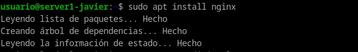
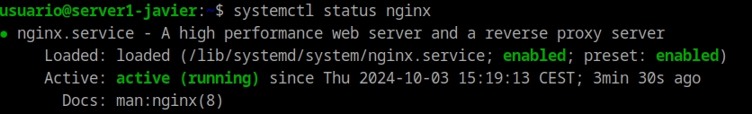


### 2.  Creación de la carpeta del sitio web

Todos los archivos de nginx se organizan en carpetas, usualmente en `/var/www`. Por lo tanto, creamos la carpeta para nuestro sitio web, en mi caso es la carpeta `Ryder` y dentro de esta la carpeta `html`  . Comando `sudo mkdir  -p  /var/www/nombre_web/html` 

Una vez creada vamos a clonar el repositorio `https://github.com/cloudacademy/static-website-example`. Aclarar que debemos instalar Git en la máquina para esto.

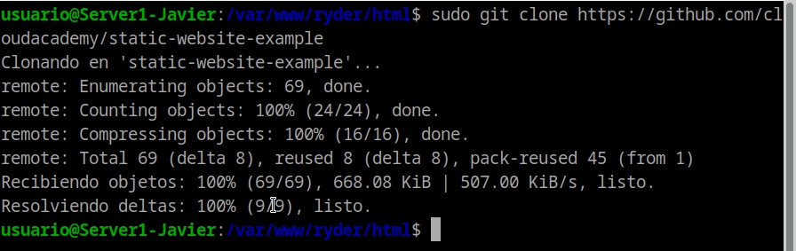

Ademas tambien haremos propietario a `www-data` de las carpetas que acabamos de crear, con el comando `sudo chown -R www-data:www-data /var/www/ryder/html`. 

Y, ademas, le daremos permisos para evitar errores de permisos con `sudo chmod -R 755 /var/www/nombre_web`.

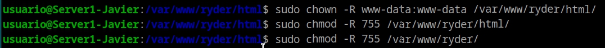

Para comparar que funciona lo nginx abrimos el navegador de la maquina virtual y vamos `http://172.23.192.254` o la IP que tengamos asignada en ese momento, en mi caso la `172.23.192.254`. Si todo ha ido bien debería mostrarse esto:

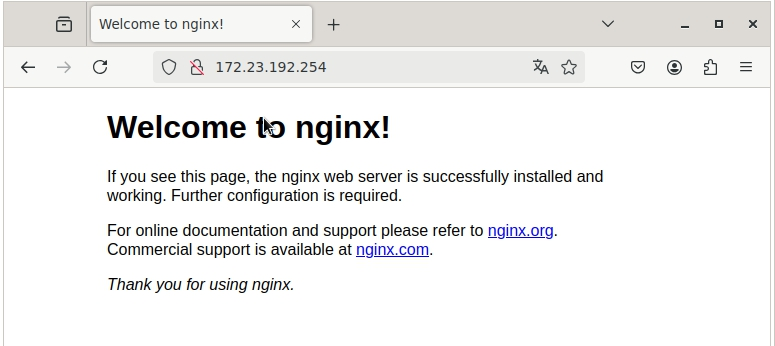

### 3. Configuración de servidor web NGNIX
Para que NGNIX maestre nuestra web debemos modificar crear un nuevo archivo dentro de la carpeta `sites-available` cuyo nombre sea el de nuestra web con el siguiente comando `sudo nano /etc/nginx/sites-available/ryder `

el contenido debe ser el siguiente

```
server {
        listen 80;
        listen [::]:80;
        root /ruta/absoluta/archivo/index;
        index index.html index.htm index.nginx-debian.html;
        server_name ryder;
        location / {
                try_files $uri $uri/ =404;
        }
}
```

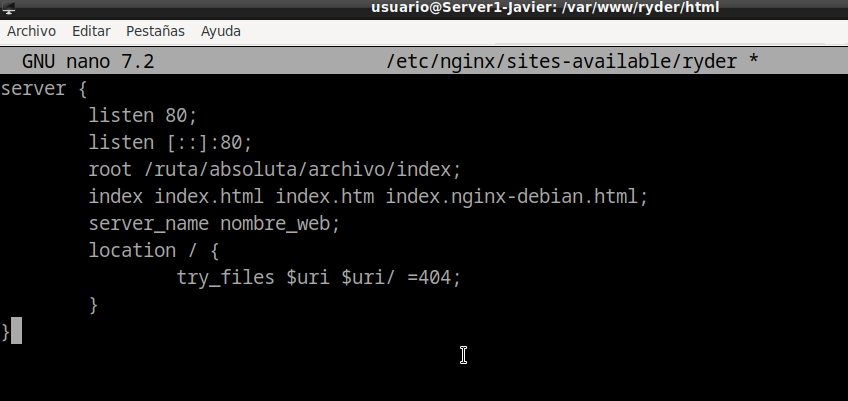

Tras esto debemos crear un archivo entre este sitio y los sitios habilitados para que se de alta automáticamente. Comando `sudo ln -s /etc/nginx/sites-available/ryder /etc/nginx/sites-enabled/`. Y reiniciamos el servicio para aplicar cambios comando `sudo  systemctl  restart  nginx`.

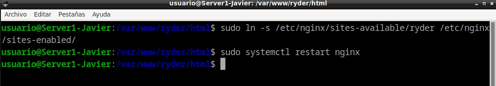

### 4. Comprobaciones
No contamos con servidor DNS que resuelva las solicitudes de nombres de ips. Parea esto, en **la maquina fisica** vamos a editar el archivo `C:\Windows\System32\drivers\etc\hosts` para añadir la linea `172.23.192.254 ryder` 

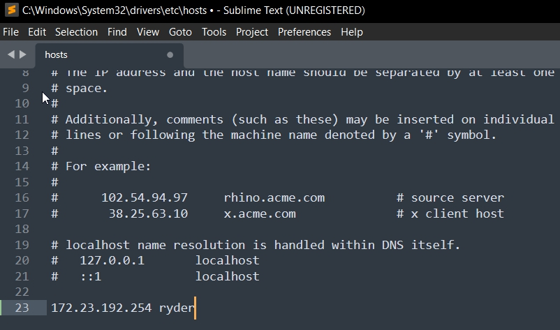

### 5.  Comprobar registros del servidor
Comprobamos que las peticiones se estan registrando en los archivos de logs. Tanto correctas como incorrectas
- `/var/log/nginx/access.log` para solicitudes correctas
- `/var/log/nginx/error.log` para solicitudes incorrectas 

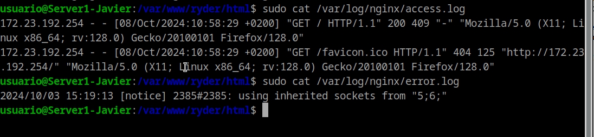

### 6. FTP
En este apartado vamos a configurar el protocolo FTP para poder transferir archivos de la maquina fisica a la virtual. Este es un protocolo obsoleto por lo que usaremos SFTP.

Primero, debemos tener actualizada la maquina. En segundo lugar instalar vsftpd `sudo  apt-get  install  vsftpd` y crear la carpeta ftp para el usuario que utilicemos, en mi caso el usuario es "usuario" `mkdir  /home/usuario/ftp`

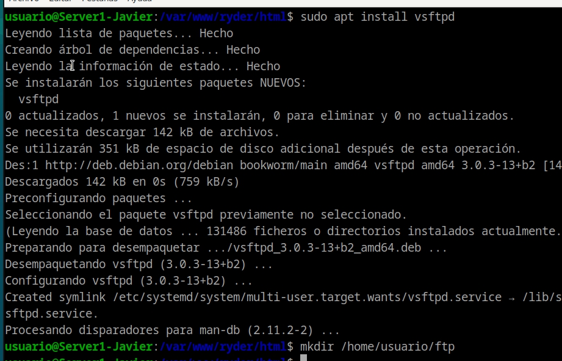

creamos los certificados de seguridad necesarios. Realizamos el proceso de credenciales. Los apartados se pueden quedar vacíos

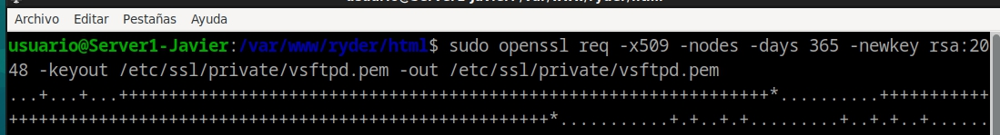

A continuacion debemos entrar al archivo de configuración de vsftpd `sudo  nano  /etc/vsftpd.conf` de este debemos borrar(o al menos comentar) las siguientes lineas

    rsa_cert_file=/etc/ssl/certs/ssl-cert-snakeoil.pem
    rsa_private_key_file=/etc/ssl/private/ssl-cert-snakeoil.key
    ssl_enable=NO

y sustituirlas por estas

    rsa_cert_file=/etc/ssl/private/vsftpd.pem
    rsa_private_key_file=/etc/ssl/private/vsftpd.pem
    ssl_enable=YES
    allow_anon_ssl=NO
    force_local_data_ssl=YES
    force_local_logins_ssl=YES
    ssl_tlsv1=YES
    ssl_sslv2=NO
    ssl_sslv3=NO
    require_ssl_reuse=NO
    ssl_ciphers=HIGH
    
    local_root=/home/usuario/ftp

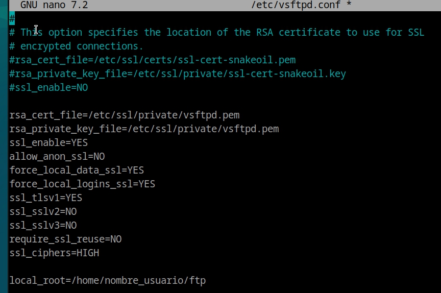

Para aplicar los cambios debemos reiniciar el servicio con el comando `sudo systemctl restart --now vsftpd`

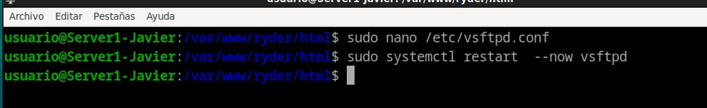

El servicio de sftp ya esta funcionando, pero para poder usarlo necesitamos un cliente ftp como es FileZilla. Descargaremos este programa en nuestra máquina física. Para conectarnos debemos poner la IP del servidor(la maquina virtual), en mi caso la `172.23.192.254`, el usuario y la contraseña habilitados, usuario en mi caso, y el puerto 22 (porque el 21 da problemas)

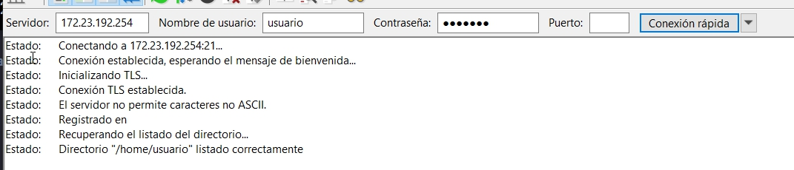

Nos dará un aviso debido al certificado que usa el servidor sftp, pero dado que nosotros mismos hemos creado el servicio podemos confiar. Tras esto podemos probar a pasar un archivo de la máquina fisica a la virtual.

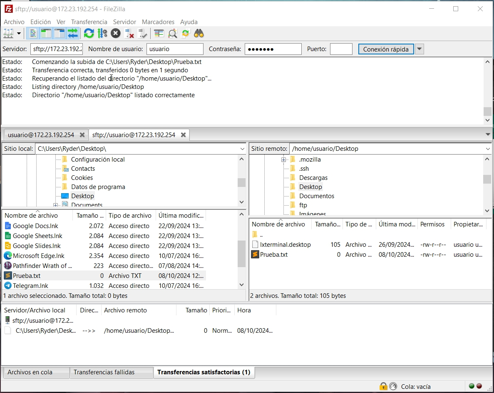

### 7. HTTPS

Para añadir seguridad a las conexiones pasando de usar http a https debemos hacer algunos cambios en cosa que ya hemos echo antes en el proceso. Lo primero sera modificar sites-enabled con `sudo nano /etc/nginx/sites-enabled/ryder` y poner lo siguiente.  Lo más importante a destacar es que estan los certificados ssl.

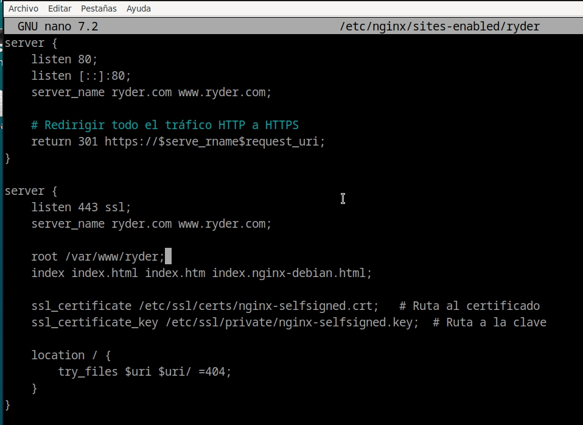

A continuación debemos generar los certificados que usamos en `sites-enabled/` . Técnicamente estos certificados no son validos pues son autofirmados, pero para ser certificados válidos habria que pagar y podemos confiar en nuestros mismos.

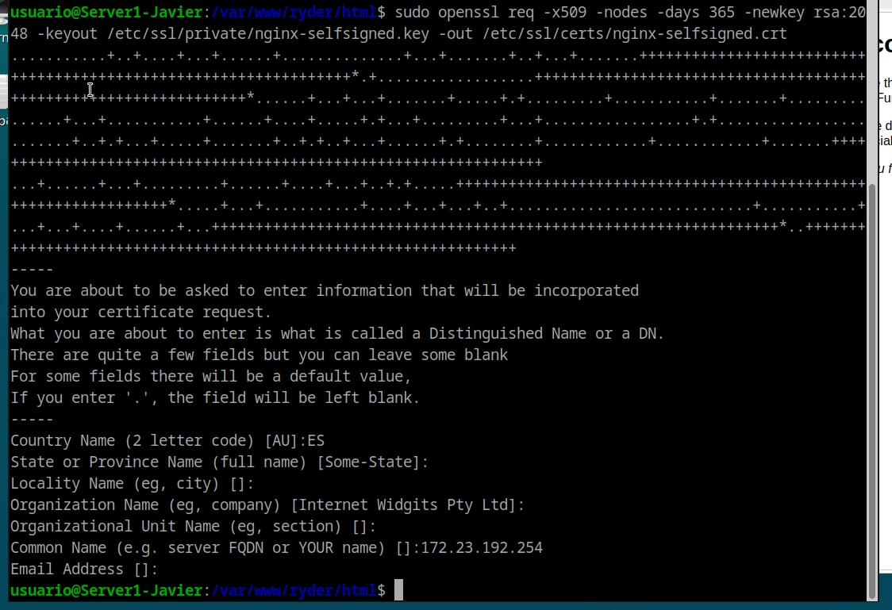

Damos permisos varios a los permisos que hemos generado

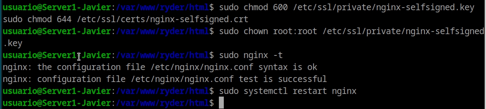

**En la maquina fisica** debemos modificar el archivo host para poder resolver la petición dns con nuestro nombre de dirección web y nuestra ip 

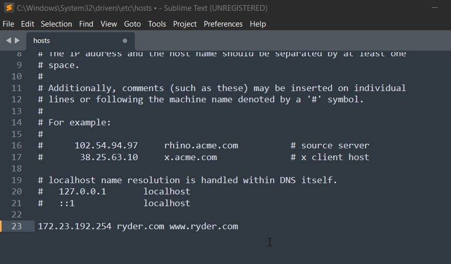

Ahora desde la máquina física podemos ver la la página http://ryder.com

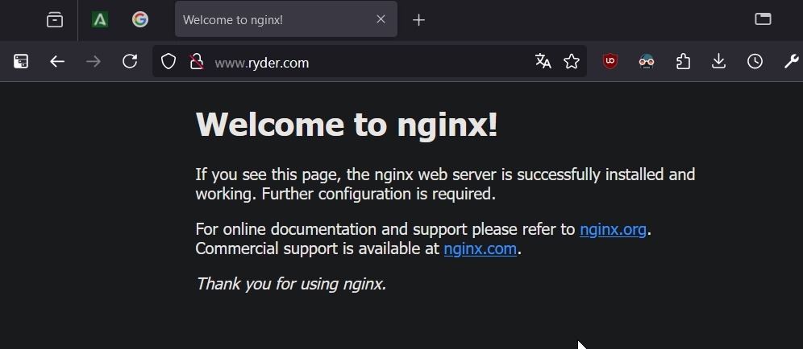

Para comprobar el funcionamiento de la version https debemos mover la web de ejemplo de la carpeta `./ryder/html/static-webside-example` a la carpeta `./ryder/` y por ultimo borramos el directorio `./html/` tener mucho cuidado con este momento pues podemos romper la maquina

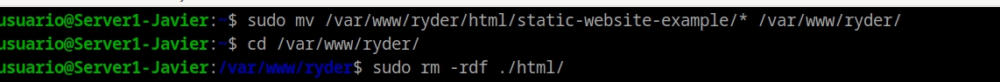

Hacemos un último test para comprobar que todo ha funcionado como queremos 

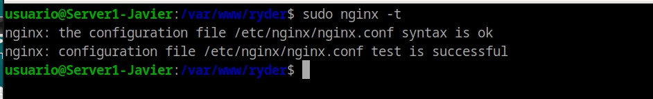


Si todo ha salido correctamente, en el navegador de nuestra maquina fisica deberia aparecer un aviso en la pagina `https://ryder.com` pues los certificados que utilizamos son auto firmados. Tambien una vez pasamos el aviso debemos ver esta pagina web.

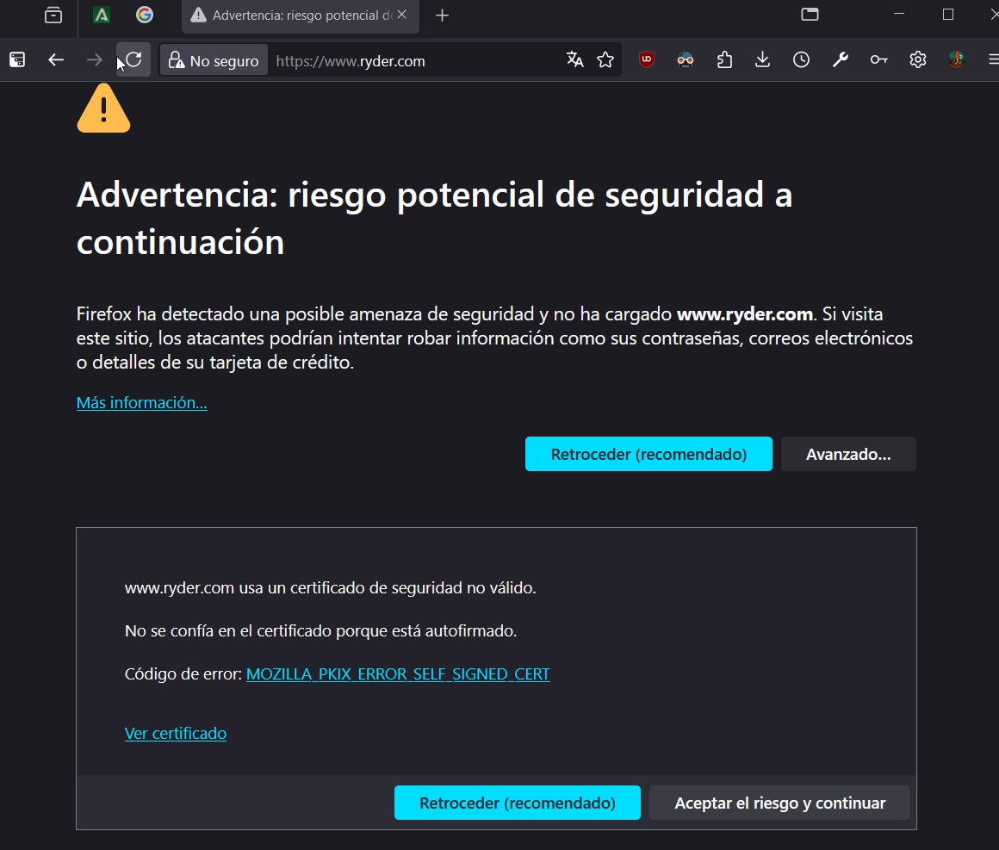

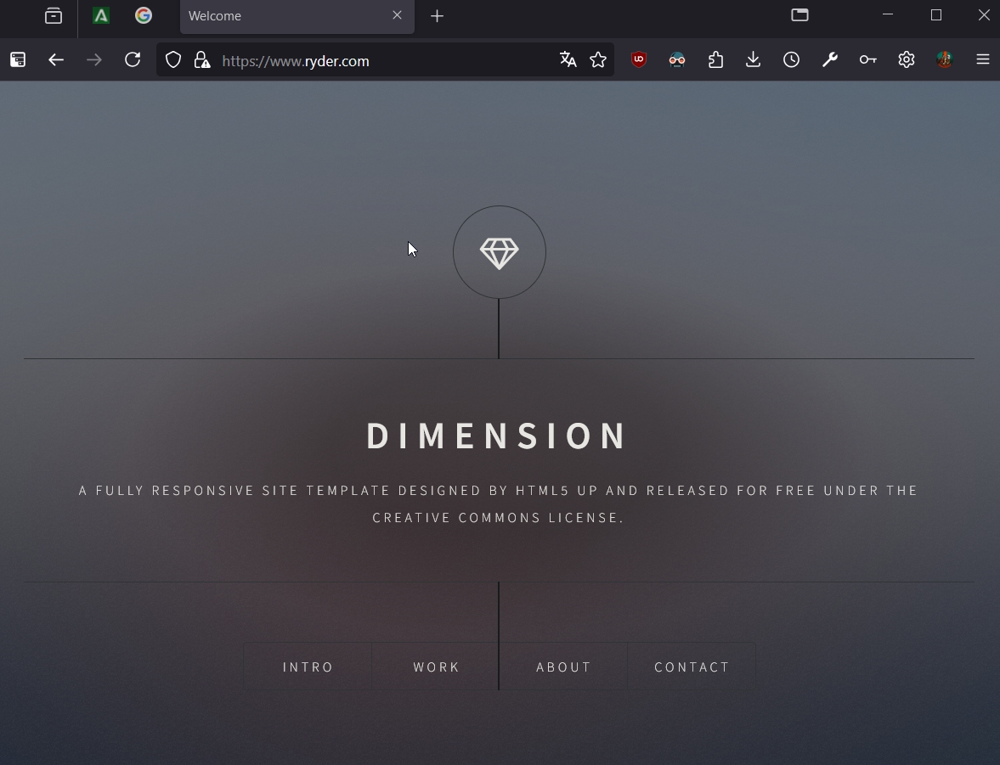

