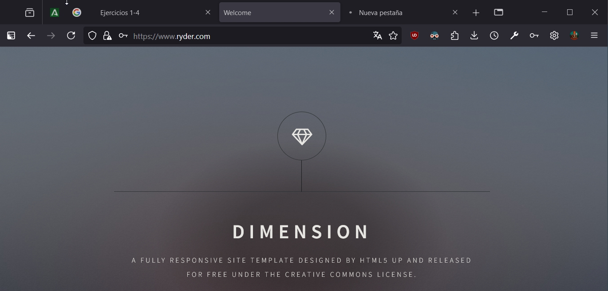

# Práctica 2.2 
##  Autenticación en Nginx
#### Javier Rider Jimenez

### 1. Introducción y paquetes necesarios 
Primero que nada debemos tener funcionando la Practica 2.1, en mi caso tuve que modificar el archivo host de mi maquina física para cambiar la IP 

Una vez que tenemos funcionando la practica anterior debemos comprobar que tenemos el paquete instalado de la herramienta OpenSSL, para crear las contraseñas cifradas. Este comando comprueba que lo tenemos instalado y si no, lo instala.

    dpkg  -l  |  grep  openssl
    

### 2. Creación de usuarios y contraseñas de acceso web
Vamos a crear 2 usuarios con sus dos respectivas contraseñas. estos usuarios tendrán guardada su contraseña de manera cifrada 

Para crear el usuario Javier usaremos este comando, indicando también donde se guarda la contraseña

    sudo  sh  -c  "echo -n 'Javier:' >> /etc/nginx/.htpasswd"

con este le añadimos una contraseña al usuario anteriormente creado, pidiendo una contraseña que después será cifrada por OpenSSL 
    
    sudo  sh  -c  "openssl passwd -apr1 >> /etc/nginx/.htpasswd"

Repetimos proceso con el usuario Rider

    sudo  sh  -c  "echo -n 'Rider:' >> /etc/nginx/.htpasswd"
    sudo  sh  -c  "openssl passwd -apr1 >> /etc/nginx/.htpasswd"

Podemos comprobar que se han creado los usuarios correctamente y que la contraseña esta totalmente cifrada 

### 3.  Configuración de Nginx para autentificación básica
Para aplicar la autentificacion basica debemos hacer modificaciones en `sites-avalible/ryder`. Con el siguiente comando

    sudo  nano  /etc/nginx/sites-available/nombre_web

Una vez aqui debemos añadir 2 lineas a `location`. estas se encargaran de solicitar el usuario-contraseña y contrastarlo con la lista de usuario-contraseña que tenemos en el servidor. debemos añadir las siguientes lineas

    auth_basic  "Área restringida";
    auth_basic_user_file  /etc/nginx/.htpasswd;
    
Quedando algo similar a esto

para acontinuacion reiniciar el servicio para aplicar el cambio

Tras esto si vamos a nuestra web `htpps://www.ryder.com`para acceder y visualizar la web primero debemos logearnos correctamente. debemos tener en cuenta que una vez introduzcamos credenciales validas se guardaran en las cookies del navegador, por lo que no lo volvera a pedir, si queremos repetir el proceso podemos hacer `ctrl + shift + r`, `ctrl + F5`, abrir una ventana privada en el navegador o borrar el historial

Para probar que **no** funciona si no ponemos credenciales validas podemos intentar logearnos con un usuario que no hemos creado, en mi caso pepe. debera darnos un error 403. como pepe no es un usuario autentificado nos redirige a la pagina del error

Para probar que **si** funciona, actualizamos la pagina, probaremos a logearnos con un usuario que **si** exista, en mi caso Javier. 

como tanto el usuario como la contraseña de Javier estan almacenadas en `.htpasswd` nos deja pasar y visualizar la web.

Ahora podemos comprobar el registro de accesos para comprobar que todo se ha registrado. Como podemos ver esta registrado que se ha intentado acceder tanto con pepe como con Javier

    sudo nano /var/log/nginx/access.log
    

pero si vamos al registro de errores veremos que solo hay un registro, indicando que el usuario pepe no esta en `.htpasswd`

	sudo nano /var/log/nginx/error.log
	

	
#### 3.1. Autentificación en contacto.html

Para poder autentificarnos en un apartado concreto de la web he tenido que hacer algunas modificaciones al `index.html` dado que este index trae todos los apartados en un mismo archivo y por limitaciones no podemos autentificar por apartados si todo esta en el mismo archivo.

Para solucionar esto, antes de modificar la configuración, debemos crear una copia de `index.hmtl` llamada (en mi caso) `contacto.html`. Este `contacto.html` es idéntico a index, con la diferencia de que hemos borrado todos los `<articulos>` que no sean el de contacto. Considero que esta explicación es suficiente.

Una vez aclarado y creado `contacto.html` podemos proceder. Debemos modiciar una vez más `sites-available/ryder`.  Debemos comentar las siguientes lienas: 

    #	auth_basic  "Área restringida";
    #	auth_basic_user_file  /etc/nginx/.htpasswd;

Para añadir un nuevo `location` específico para `contacto.html` ahora al acceder a la web principal no nos pide contraseña. Pero para entrar al apartado Contacto nos obliga a autentificarnos

    location /contacto.html { 
		auth_basic "Area restringida"; 
		auth_basic_user_file /etc/nginx/ .htpasswd;
	}
	
debiendo quedar algo similar a esto

Por último reiniciar el servicio antes de poder empezar a probar lo

Ahora que esta reiniciado servicio nos dirigimos a la direccion `https://www.ryder.com/contacto.html` y como podemos ver nos pide autentificación antes de mostrar el formulario de contacto

### 4. Autentificación básica con restricción por acceso por IP
Para realizar este apartado no es necesario deshacer el apartado 3.1.
#### 4.1 Denegar una IP
Para denegar el acceso a una IP concreta debemos modificar una vez mas `sites-available/ryder`. Descomentamos las lineas comentadas del `location` y añadimos la linea `deny IP` esta ip sera la que no podra acceder a la web, probaremos con la IP de la maquina fisica. Tambien se podria usar `deny all` para bloquear todas las IPs
	
	deny 172.30.144.1;
	auth_basic "Area restringida"; 
	auth_basic_user_file /etc/nginx/ .htpasswd;

tras esto reiniciamos el servicio

si ahora, desde la maquina fisica, intentamos acceder a la web nos dará un error 403. pues no tenemos permiso para acceder con esta ip

#### 4.2. Permitir IPs
Para permitir IPs concretas haremos el mismo proceso que el anterior pero utilizando `allow IP`. En solitario, sin `deny all`, es inútil en pero será aclarado en el siguiente punto. `allow ip` o `allow all` permite el acceso a las IPs indicadas, al contrario que  `deny`

	satisfy all;
	allow 172.30.144.1;
	auth_basic "Area restringida"; 
	auth_basic_user_file /etc/nginx/ .htpasswd;

tras esto reiniciamos el servicio

si ahora, desde la máquina física, intentamos acceder a la web, nos pedirá el loguearnos, se explica en el siguiente punto

#### 4.3. Satisfy all
En el apartado anterior he añadido `satisfy all;`, esta configuración se utiliza para permitir el uso cambiando de una ip valida (con `allow` o `deny`) y ademas ser un usuario valido. si una de las dos validaciones no es correcta el usuario no puede acceder a la web.

en cambio si usamos `satisfy any;` mientras el usuario **o** la ip sean validas el usuario podrá acceder a la web

### 5. Cuestiones
#### 5.1. Cuestion 1:

> Supongamos que yo soy el cliente con la IP 172.1.10.15 e intento acceder al directorio `web_muy_guay` de mi sitio web, equivocándome al poner el usuario y contraseña. ¿Podré acceder?¿Por qué?

    location /web_muy_guay {
    #...
	    satisfy all;    
	    deny  172.1.10.6;
	    allow 172.1.10.15;
	    allow 172.1.3.14;
	    deny  all;
	    auth_basic "Cuestión final 1";
	    auth_basic_user_file conf/htpasswd;
	}

El usuario no podra acceder a la web. Tiene una IP permitida dentro de la configuracion, pero necesita tener tanto una IP valida como autentificarse correctamente. esto debido a la presencia de  `satisfy all;  `

#### 5.2. Cuestión 2

> ask "Cuestión 1" Supongamos que yo soy el cliente con la IP
> 172.1.10.15 e intento acceder al directorio web_muy_guay de mi sitio web, introduciendo correctamente usuari y contraseña. ¿Podré
> acceder?¿Por qué?

    location /web_muy_guay {
	    #...
	    satisfy all;    
	    deny  all;
	    deny  172.1.10.6;
	    allow 172.1.10.15;
	    allow 172.1.3.14;

	    auth_basic "Cuestión final 2: The revenge";
	    auth_basic_user_file conf/htpasswd;
	}

En esta ocasión si se podrá acceder a la web pues se utiliza una IP admitida y una autentificación correcta.

#### 5.3. Cuestión 3

> Supongamos que yo soy el cliente con la IP 172.1.10.15 e intento acceder al directorio web_muy_guay de mi sitio web, introduciendo correctamente usuario y contraseña. ¿Podré acceder?¿Por qué?

    location /web_muy_guay {
    #...
	    satisfy any;    
	    deny  172.1.10.6;
	    deny 172.1.10.15;
	    allow 172.1.3.14;

	    auth_basic "Cuestión final 3: The final combat";
	    auth_basic_user_file conf/htpasswd;
	}

Podrá acceder. dado que la presencia de `satisfy any` indica que teniendo una ip valida **o** introduciendo unas credenciales correctas podemos acceder a la web

#### 5.4. Cuestión 4

> A lo mejor no sabéis que tengo una web para documentar todas mis excursiones espaciales con Jeff, es esta: Jeff Bezos y yo
> 
> Supongamos que quiero restringir el acceso al directorio de proyectos porque es muy secreto, eso quiere decir añadir autenticación básica a la URL:Proyectos
> 
> Completa la configuración para conseguirlo:

original:

    server {
        listen 80;
        listen [::]:80;
        root /var/www/freewebsitetemplates.com/preview/space-science;
        index index.html index.htm index.nginx-debian.html;
        server_name freewebsitetemplates.com www.freewebsitetemplates.com;
        location              {

            try_files $uri $uri/ =404;
        }
    }

solucionado:

	server {
	    listen 80;
	    listen [::]:80;
	    root /var/www/freewebsitetemplates.com/preview/space-science;
	    index index.html index.htm index.nginx-debian.html;
	    server_name freewebsitetemplates.com www.freewebsitetemplates.com;

	    location / {
	        try_files $uri $uri/ =404;
	    }

	    location /Proyectos/ {
	        auth_basic "Restricted Area"; # Mensaje que verá el usuario al intentar acceder
	        auth_basic_user_file /etc/nginx/.htpasswd; # Ruta del archivo de contraseñas
	        try_files $uri $uri/ =404;
	    }
	}

<!--stackedit_data:
eyJoaXN0b3J5IjpbLTU1OTQ1Mjc3NiwtMTk5MDkxODI3MCwxMD
EzMDQ2MjIxLC03OTA1OTE3NDMsMTE5NzMxMDE2MiwxMjI5MDc4
MjIwLC0xMTY1MzA4MzEyLC00NTE3MTIzNzksLTE5OTc0NzQ4ND
hdfQ==
-->