# Práctica 2.3
## Proxy inverso con Nginx
#### Javier Rider Jimenez

### 0. Preparativos

Antes de empezar debemos tener 2 maquinas virtuales. podemos clonar la maquina de las practicas anteriores cambiando la mac. También podemos cambiar el nombre de la maquina pero no es necesario en si, solo seria para tenerlo mas claro

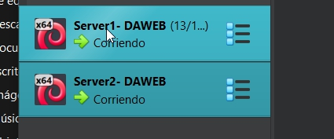

Debemos comprobar el archivo host de la maquina fisica. debido a que podria haber cambiado la ip de la maquina virtual que utiliza el proxy. Tambien que debemos poner la redireccion manual en el archivo host de la maquina fisica.

nota: he quitado el .com del enlace porque me daba problemas, parece que era una direccion ya cogida

lo importante del archivo host es que debe tener la ip de la maquina PROXY y una direccion web


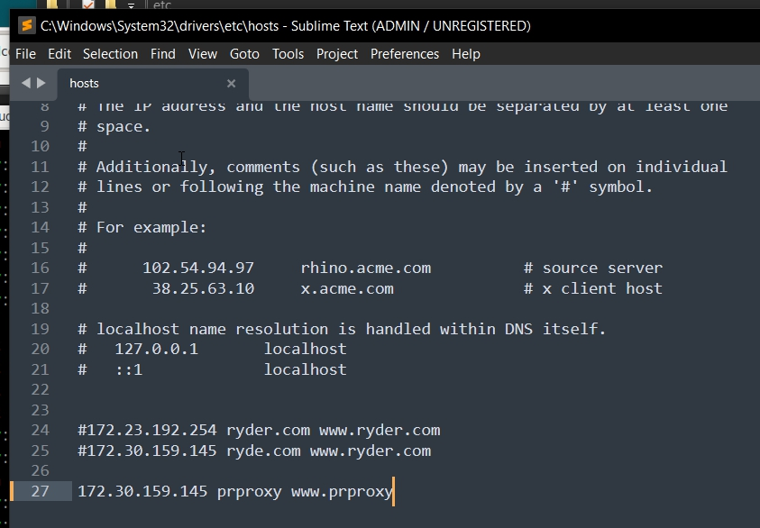

### 1. Nginx servidor web

Vamos a configurar la maquina que hace de cliente en la relación proxy inverso. Esta maquina es la que almacena la pagina web que después visualizaremos a traves del proxy inverso.

Esta maquina es servidor2, la clonacion de servidor1. Por tanto primero debemos eliminar el enlace simbolico entre la web anterior (ryder.com) y crear uno nuevo con servidorweb, que es la que vamos a usar en esta practica. 

el archivo de configuracion de servidorweb es el siguiente:

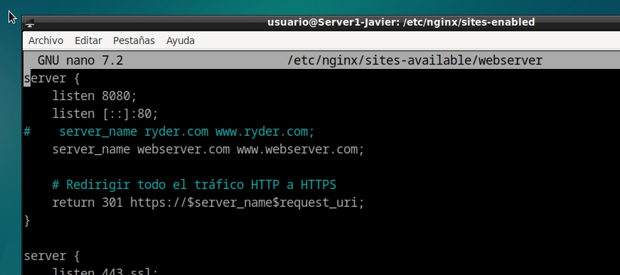

el comamndo para eliminar el enlace simbolico es, dentro de la carpeta `sites-enabled` el siguiente:

```bash
unlink ryder
```

Ahora creamos el enlace simbolico con el archivo de configuracion de servidorweb

```bash
ln -s /etc/nginx/sites-available/servidorweb /etc/nginx/sites-enabled/
```

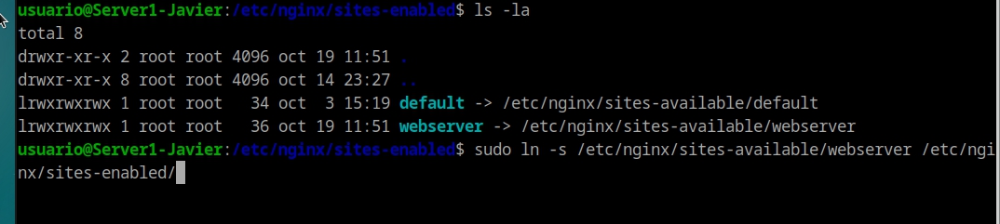


### 2. Configuración del proxy inverso
Antes de empezar a modificar el arhivo de configuracion debemos añadir la ip de la maquina servidorweb en el archivo host de la maquina proxy. (similar a como lo hemos echo en la maquina fisica)

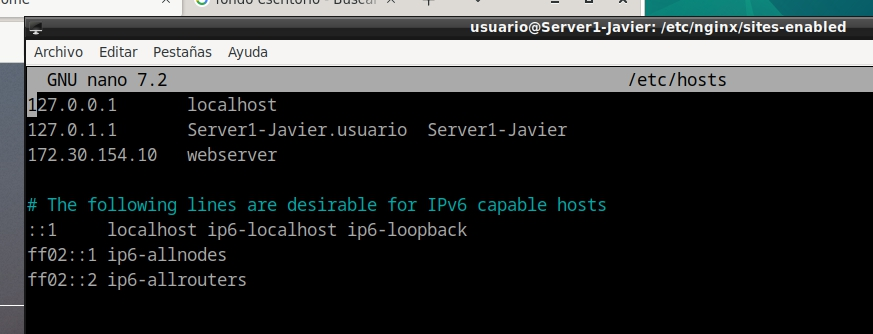

ahora, creamos el archivo de configuracion de nginx en la maquina proxy. Este archivo es el que se encarga de redirigir las peticiones a la maquina servidorweb. 

el contenido del archivo de configuracion de nginx en la maquina proxy es el siguiente:

```bash

server { 
    listen 80; 
    server_name prproxy www.prproxy; 
    location / { 
    proxy_pass http://webserver; 
    } 
} 

```

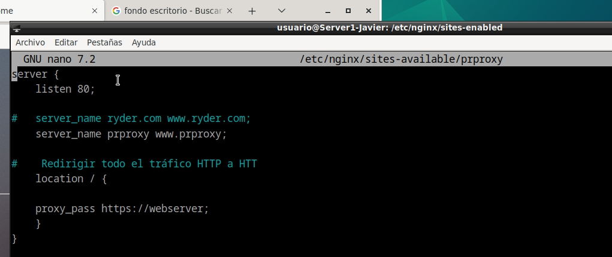

Tambien nos aseguramos de eliminar el enlace simbolico de ryder.como y crear uno nuevo con el archivo de configuracion de proxy

```bash
unlink ryder
```

```bash
ln -s /etc/nginx/sites-available/prproxy /etc/nginx/sites-enabled/
```

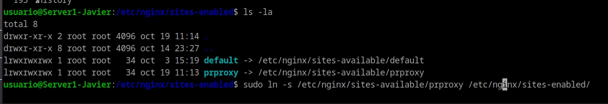

### 3. Comprobaciones

Ahora, en la maquina fisica, abrimos un navegador y escribimos la direccion web que hemos puesto en el archivo host de la maquina fisica. y como podemos ver, la pagina web que hemos configurado en la maquina servidorweb se muestra en el navegador de la maquina fisica.


### 4. Cabeceras

Ahora añadimos unas cabeceras, que se mostraran cuando accedamos a la web desde la maquina fisica.

```bash
add_header Host prproxy_javier;
```

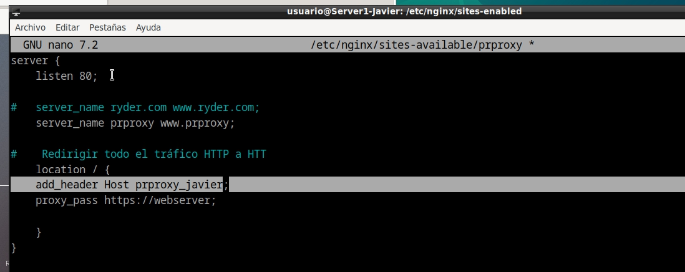


si vamos al navegador podemos ver que efectivamente esta la cabecera del proxy

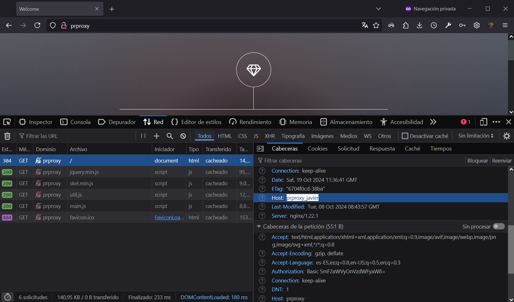

y su ahora añadimos una al archivo de configuracion de servidorweb

```bash
add_header Host servidor_web_Ryder;
```

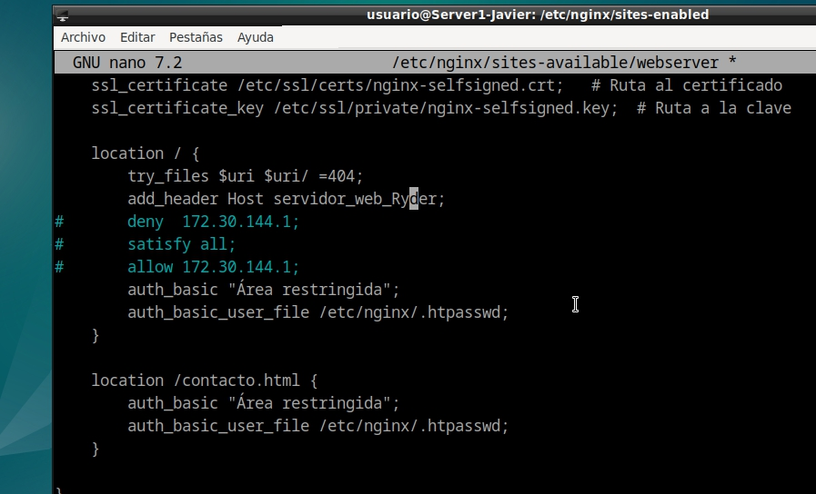

y volvemos a acceder a la web desde la maquina fisica, podemos ver que tambien se muestra la cabecera del servidorweb

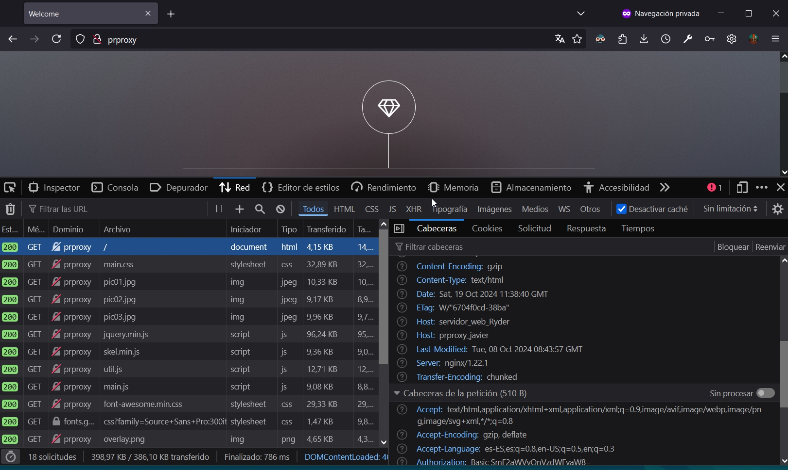

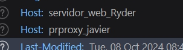
