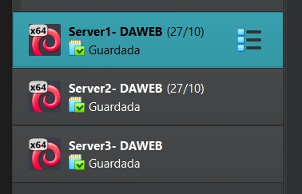
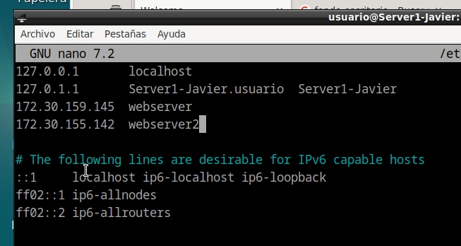
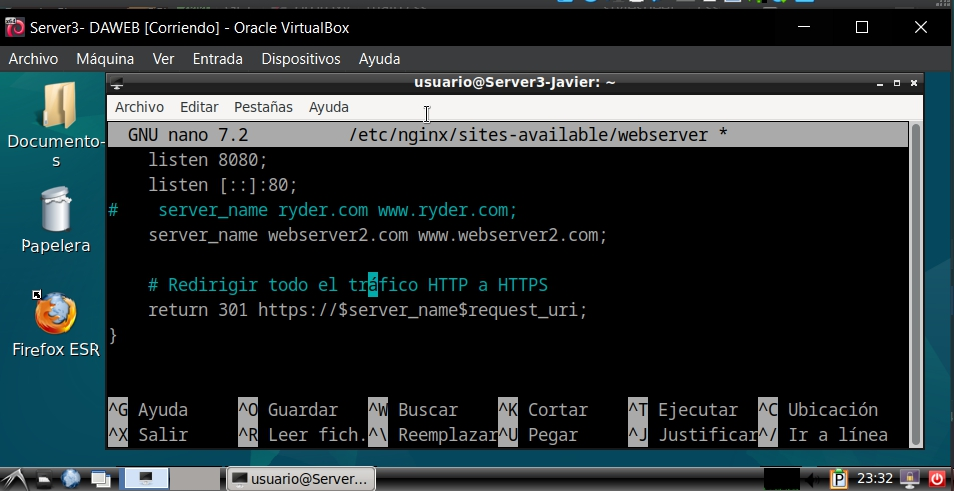
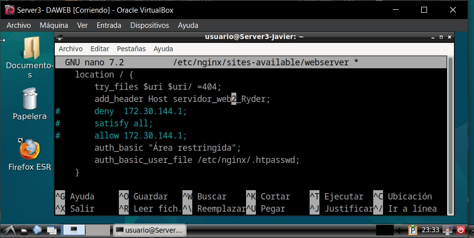
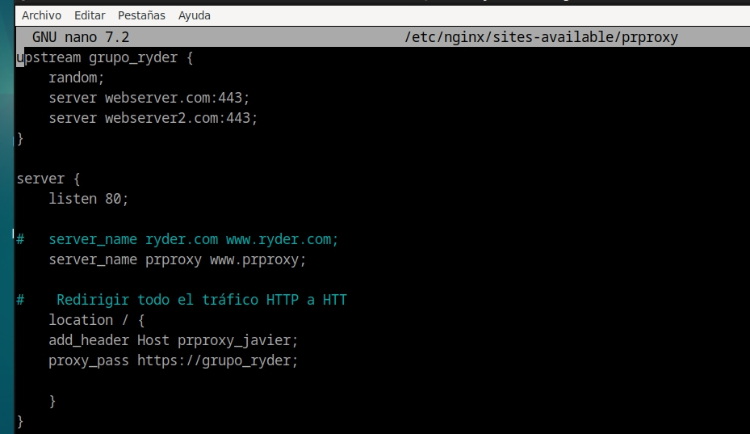
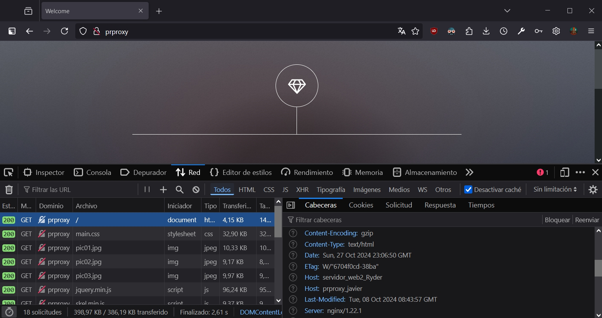
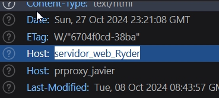

# Práctica 2.4
## Balanceo de carga con proxy inverso en Nginx
#### Javier Rider Jimenez


### 0. Preparativos

Antes de empezar debemos tener 3 maquinas virtuales. podemos clonar la maquina de las practicas anteriores cambiando la mac. También podemos cambiar el nombre de la maquina pero no es necesario en si, solo seria para tenerlo mas claro



Tambien debemos asegurarnos de que nuestra maquina proxy tiene acceso a las otras dos maquinas. Para ello debemos añadir las ips de las maquinas servidor1 y servidor2 en el archivo host de la maquina proxy.

Debemos revisar que las ip son las correctas. porque al ser fijas pueden cambiar. También debemos comprobar que el archivo host de la maquina física tiene la redirection manual a la maquina proxy.



### 1. Nginx servidor web 2

Partiendo de que hemos clonado una maquina con servidorweb funcionando. solo tenemos que modificar ese archivo. no es necesario cambiarle el nombre.

El archivo de configuración de servidorweb es el siguiente:




### 2. Configuración del proxy inverso

Ahora debemos añadir en sites-available de prproxy  el siguiente fragmento de configuración:

este fragmento indica a que webserver se van a redirigir las peticiones. el condicional es un aleatorio

```bash
upstream grupo_ryder {
    random;
    server webserver:443;
    server webserver2:443;
}

location / {
    proxy_pass https://grupo_ryder;
}
```




### 3. Comprobaciones y resultado

ahora si vamos a la web http://prproxy nos redirigirá de manera aleatoria a uno de los dos deserver.

podemos ver que servidor esta atendiendo la petición gracias a las cabeceras que hemos configurado






