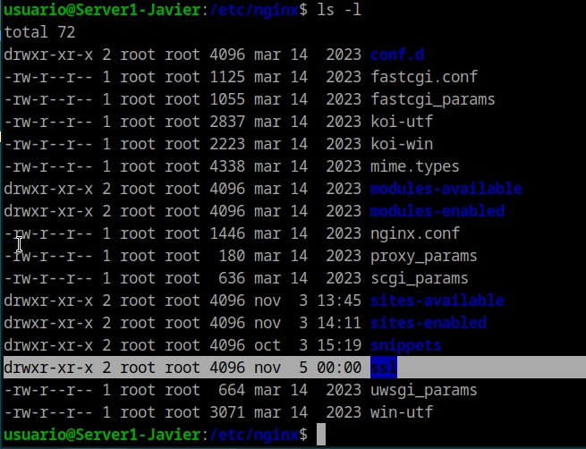
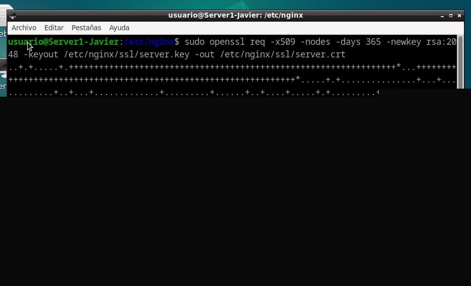
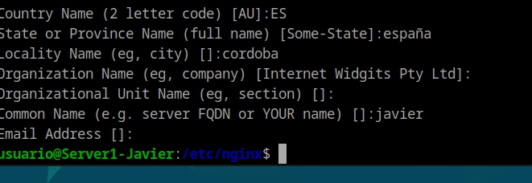
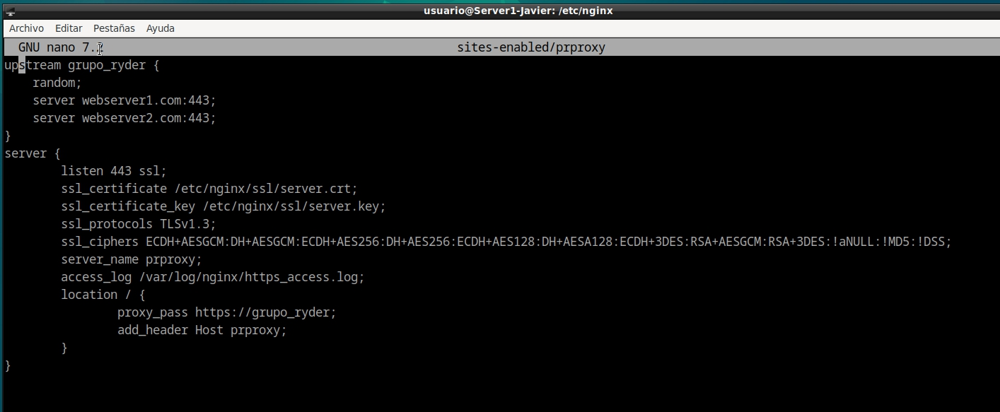
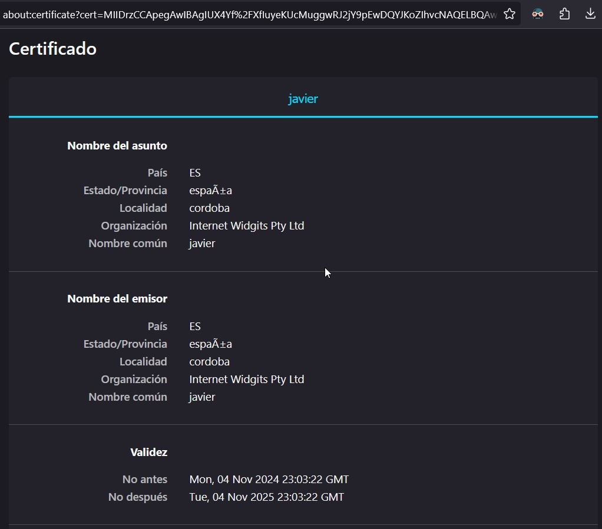

# Práctica 2.5
## Proxy inverso y balanceo de carga con SSL en NGINX
#### Javier Rider Jimenez

### 1. Generar permisos SSL

Primero debemos crear una carpeta en la maquina proxy para guardar los certificados SSL. En la carpeta `/etc/nginx/` creamos una carpeta llamada `ssl` 



Ahora creamos los certificados SSL con el siguiente comando:

```bash
openssl req -x509 -nodes -days 365 -newkey rsa:2048 -keyout /etc/nginx/ssl/nginx.key -out /etc/nginx/ssl/nginx.crt
```



y rellenamos los campos que nos pide el comando. no son necesarios todos.




### 2. Configuración del proxy inverso

Ahora modificamos el archivo de configuración de prproxy. Añadimos las siguientes lineas:

```bash
server { 
    listen 443 ssl; 
    server_name prproxy www.prproxy; 
    ssl_certificate /etc/nginx/ssl/nginx.crt; 
    ssl_certificate_key /etc/nginx/ssl/nginx.key; 
    ssl_protocols TLSv1.3;
    ssl_ciphers 'TLS_AES_256_GCM_SHA384:TLS_CHACHA20_POLY1305_SHA256:TLS_AES_128_GCM_SHA256:ECDHE-RSA-AES256-GCM-SHA384:ECDHE-RSA-CHACHA20-POLY1305:ECDHE-RSA-AES128-GCM-SHA256';
    location / { 
    proxy_pass http://webserver; 
    add_header Host prproxy;
    } 
} 
```



Ahora si vamos al navegador y vamos la dirección `https://prproxy` podemos ir a ver los datos del certificado ssl que hemos creado.



### 3. Añadir redirección a la web

Ahora añadimos una redirección a la web. Para ello añadimos las siguientes lineas al archivo de configuración de prproxy:

```bash
server { 
    listen 80; 
    server_name prproxy www.prproxy; 
    access_log /var/log/nginx/http_access.log;
    return 301 https://prpoxy$request_uri; 
} 
```


ahora si vamos al navegador y escribimos la dirección `http://prproxy` nos redirige a la dirección `https://prproxy`


### 4. Cuesciones
#### 4.1 Cuestion 1
Hemos configurado nuestro proxy inverso con todo lo que nos hace falta pero no nos funciona y da un error del tipo This site can't provide a secure connection, ERR_SSL_PROTOCOL_ERROR.

Dentro de nuestro server block tenemos esto:
```bash
server {
    listen 443;
    ssl_certificate /etc/nginx/ssl/enrico-berlinguer/server.crt;
    ssl_certificate_key /etc/nginx/ssl/enrico-berlinguer/server.key;
    ssl_protocols TLSv1.3;
    ssl_ciphers ECDH+AESGCM:DH+AESGCM:ECDH+AES256:DH+AES256:ECDH+AES128:DH+AES:ECDH+3DES:DH+3DES:RSA+AESGCM:RSA+AES:RSA+3DES:!aNULL:!MD5:!DSS;
    server_name enrico-berlinguer;
    access_log /var/log/nginx/https_access.log;

    location / {
        proxy_pass http://red-party;
        }
    }
```

Esto puede ser debido a que el navegador no confia en el certificado SSL que hemos creado. Para solucionar esto debemos añadir el certificado a la lista de certificados de confianza del navegador. Para ello, en el navegador, vamos a la configuración y buscamos la opción de certificados. Ahí añadimos el certificado que hemos creado.


#### 4.2 Cuestion 2
Imaginad que intentamos acceder a nuestro sitio web HTTPS y nos encontramos con el siguiente error:


NET::ERR_CERT_REVOKED

Investigad qué está pasando y como se ha de solucionar.

Este error se produce cuando el certificado SSL que hemos creado ha sido revocado. Esto puede ser debido a que el certificado ha sido robado o que el certificado ha sido creado con una autoridad de certificación que no es de confianza. Para solucionar este problema debemos crear un nuevo certificado SSL y añadirlo a la lista de certificados de confianza del navegador. Para ello, en el navegador, vamos a la configuración y buscamos la opción de certificados. Ahí añadimos el certificado que hemos creado.


