# Práctica 3.1
## Instalación de Tomcat
#### Javier Rider Jimenez

### 1. Instalación de Tomcat
Primero debemos instalar el servidor Tomcat. Para ello ejecutamos el siguiente comando:
```bash
sudo apt install tomcat10 tomcat10-admin
```

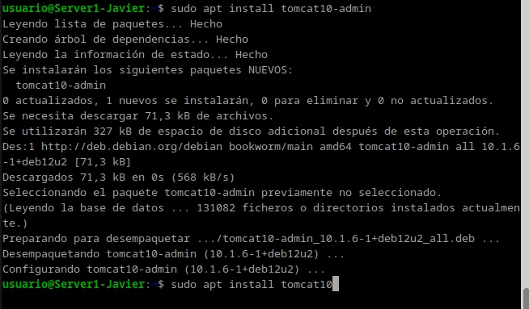

Tambien en caso de no tenerlo instalado instalamos java 
```bash
sudo apt install default-jdk
```
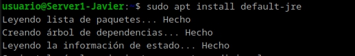
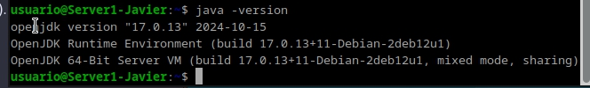

### 2. Configuración de Tomcat

comprobamos el puerto que esta en escucha con el comando:
```bash
ss -tln
```
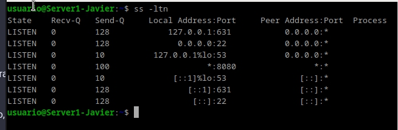


Ahora modificamos el archivo de configuración de Tomcat. Añadimos las siguientes lineas:
```bash
sudo nano /etc/tomcat10/server.xml
```

```xml
<user username="manager" password="usuario" roles="manager-gui"/>
```

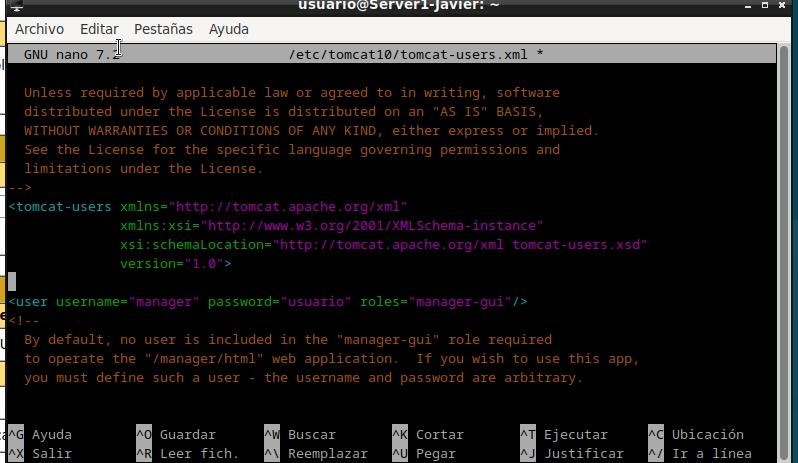

Reiniciamos el servicio de Tomcat con el comando:
```bash
sudo systemctl restart tomcat10
```

compobamos que el servicio esta en ejecución con el comando:
```bash
sudo systemctl status tomcat10
```
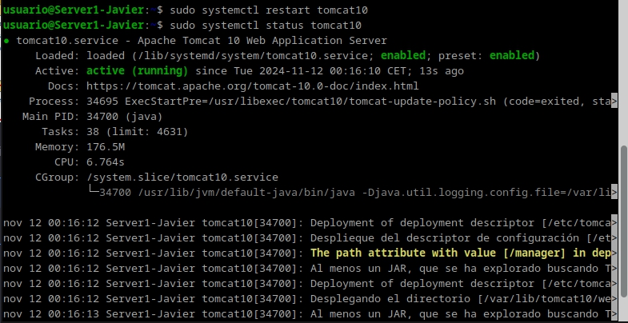


### 3. Acceso a la interfaz de administración

Ahora si vamos al navegador y vamos la dirección `http://localhost:8080/manager/html` podemos acceder a la interfaz de administración de Tomcat. Para acceder, introducimos el usuario y contraseña que hemos configurado en el archivo de configuración.

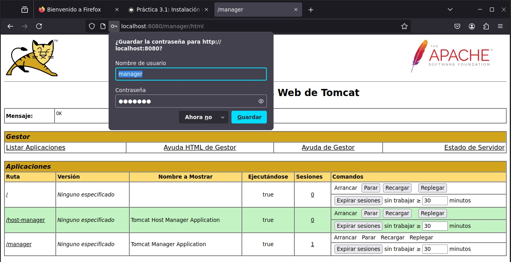

### 4. Despliegue de una aplicación

En la interfaz de administración de Tomcat, en la sección de `WAR file to deploy`, seleccionamos el archivo `.war` que queremos desplegar y pulsamos el botón de `Deploy`.

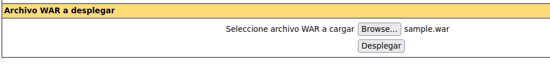

Una vez desplegado en la misma web `http://localhost:8080/manager/html` veremos que se ha cargado correctamente la aplicacion. Damos click en el nombre de la aplicacion y nos llevara a la pagina de inicio de la aplicacion.

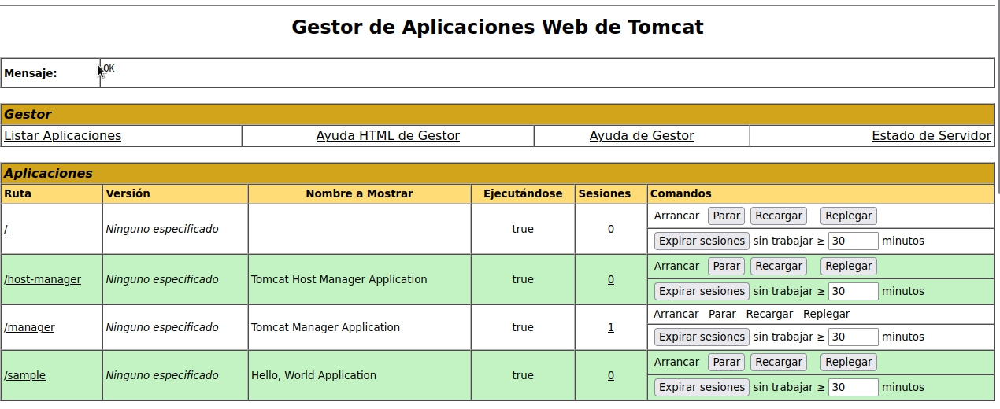

La aplicación funcionando correctamente.

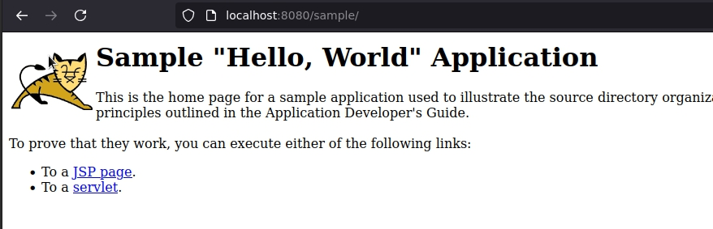


### 5. Instalación de Maven

Instalamos Maven con el siguiente comando:

```bash
sudo apt install maven
```

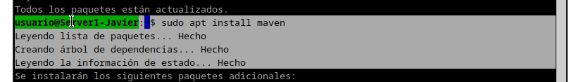

y con el siguiente comando comprobamos la versión de Maven:
```bash
mvn --v
```

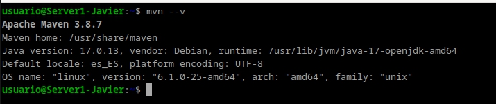

Ahora que esta funcionando reinicia el servicio de Tomcat con el comando:
```bash
sudo systemctl restart tomcat10
```

y chequeamos que el servicio esta en ejecución con el comando:
```bash
sudo systemctl status tomcat10
```
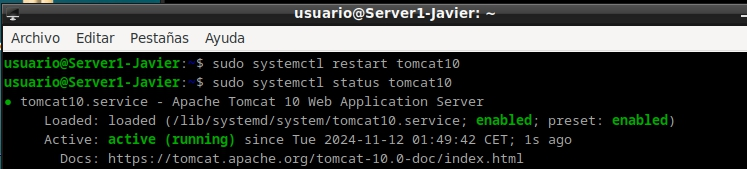

### 6. Configuración de Maven

Ahora modificamos el archivo de configuración de Maven. Añadimos las siguientes lineas dentro de la etiqueta `<servers>`:
```bash
sudo nano /etc/maven/settings.xml
```

```xml
<servers>
    <server>
        <id>TomcatP3.1</id>
        <username>ryder-deploy</username>
        <password>usuario</password>
    </server>
</servers>
```

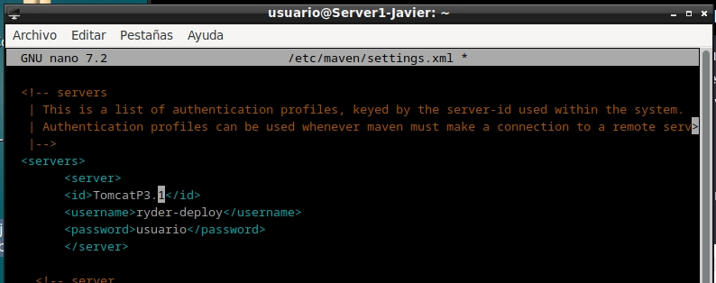


### 7. Despliegue de una aplicación con Maven

Primero debemos añadir un usuario en Tomcat. Para ello modificamos el archivo de configuración de Tomcat. Añadimos las siguientes lineas:
```bash
sudo nano /etc/tomcat10/tomcat-users.xml
```

```xml
<user username="ryder-deploy" password="usuario" roles="manager-script"/>
```

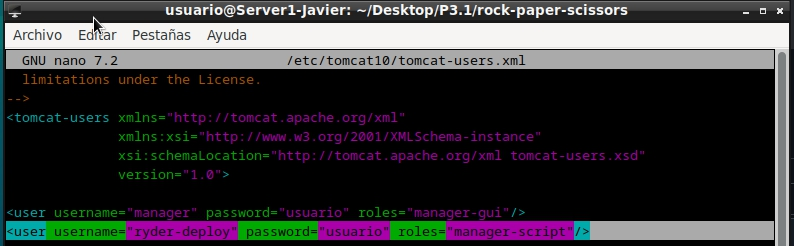

Debemos bajarnos un proyecto de ejemplo de Maven. en mi caso he usado un juego de piedra papel o tijera. Utilizando `git clone` descargamos el proyecto.

Una vez con el proyecto descargado, nos movemos a la carpeta del proyecto y ejecutamos el siguiente comando:
```bash
sudo nano /ruta/del/proyecto/pom.xml
```


y añadimos las siguientes lineas dentro de las etiquetas `<build>` y `<plugins>`:

```xml
<plugin>
    <groupId>org.apache.tomcat.maven</groupId>
    <artifactId>tomcat7-maven-plugin</artifactId>
    <version>2.2</version>
    <configuration>
        <url>http://localhost:8080/manager/text</url>
        <server>TomcatP3.1</server>
        <path>/ryderJuego</path>
    </configuration>
</plugin>
```

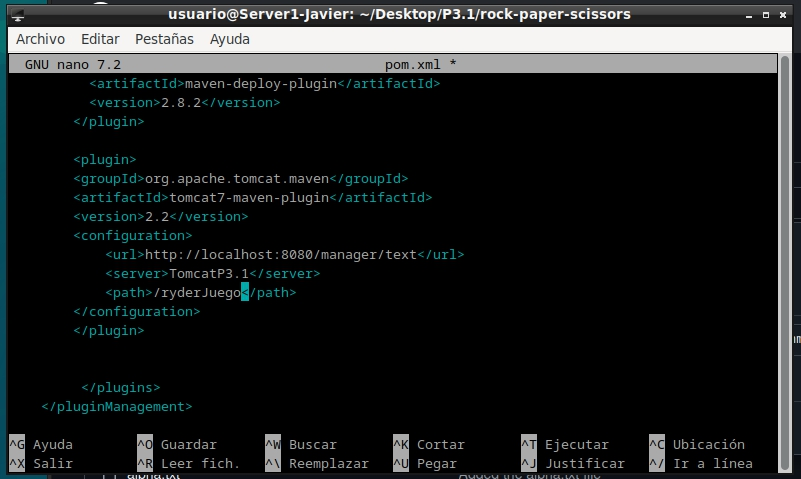


ahora podemos probar que maven esta funcionando correctamente con el comando:
```bash
mvn tomcat7:deploy
```
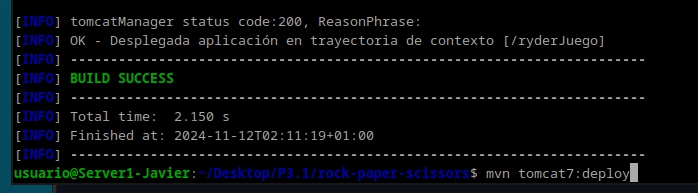

y si volvemos a la interfaz de administración de Tomcat, veremos que se ha desplegado la aplicación correctamente.

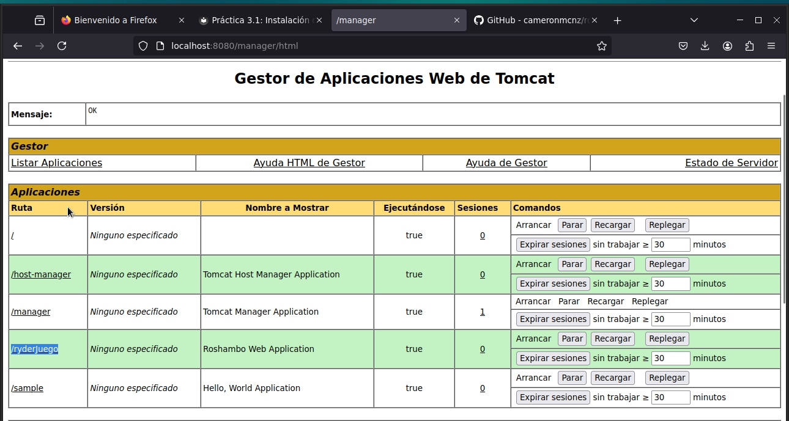

y la aplicación funcionando correctamente.

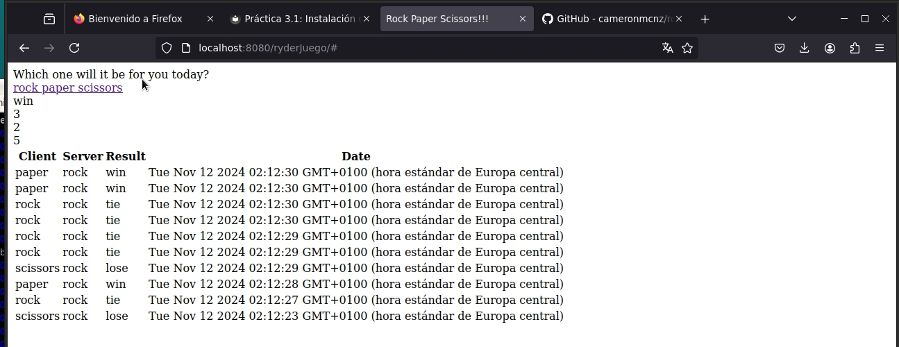


