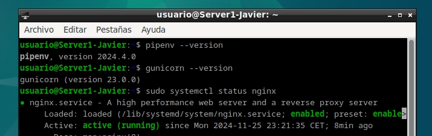

# Práctica 3.3  
## Despliegue de una aplicación Flask (Python)  
#### Javier Rider Jimenez  

---

# 0. Preparativos  
Es necesario tener instalado:  
- Nginx  
- Gunicorn  
- Pipenv  

  

---

# 1. Creación de una aplicación con Flask  

Primero es necesario crear una carpeta para nuestra aplicación y acceder a ella. Además, darle los permisos necesarios y privilegios adecuados.  

  

Dentro de esta carpeta, creamos el archivo oculto `.env` con el siguiente contenido:  

```bash  
FLASK_APP=wsgi.py  
FLASK_ENV=production  
```  

  

---

# 2. Instalación de Flask  

Abrimos la consola de pipenv con el comando `pipenv shell` y instalamos Flask con el comando `pipenv install flask gunicorn`.  

  

  

---

# 3. Creación de la aplicación  

Creamos una aplicación genérica para probar el funcionamiento de Flask.  

  

También creamos el archivo `wsgi.py` con el siguiente contenido:  

  

  

Usamos `flask run --host '0.0.0.0'` para probar la aplicación en el navegador.  

  

Buscamos la IP de la máquina con el comando `ip a` y accedemos a la aplicación con la IP y el puerto 5000 desde el navegador.  

  

---

# 4. Configuración de Gunicorn  

Con `gunicorn --workers 2 wsgi:app`, creamos un servidor de aplicaciones en el puerto 8000.  

  

También anotamos la ruta de Gunicorn con `which gunicorn` para usarla en el archivo de configuración de Nginx.  

  

Desactivamos el entorno virtual con `deactivate`.  

  

---

# 5. Configuración de Nginx  

Iniciamos el servicio de Nginx.  

  

Creamos el archivo systemd para Gunicorn con `sudo nano /etc/systemd/system/gunicorn.service` y añadimos el siguiente contenido:  

  

Lo activamos con los comandos:  

```bash  
systemctl enable flask_app.service  
systemctl start flask_app.service  
systemctl status flask_app.service  
```  

  

Ahora creamos el archivo de configuración de Nginx con `sudo nano /etc/nginx/sites-available/flask_ryder` y añadimos el siguiente contenido:  

  

Lo activamos con los comandos:  

```bash  
ln -s /etc/nginx/sites-available/flask_ryder /etc/nginx/sites-enabled  
systemctl restart nginx  
```  

  

  

Añadimos la IP de la máquina en el archivo de hosts con `sudo nano /etc/hosts` y agregamos la IP junto con el nombre del dominio.  

  

Accedemos a la aplicación con el nombre del dominio en el navegador.  

  

---

# 6. Repetir con un repositorio de GitHub  

Clonamos el repositorio de GitHub con el comando `git clone`.  

  

---

Volvemos a crear el entorno virtual con `pipenv shell` y ejecutamos `pipenv install` para instalar las dependencias. creamos el archivo `.env` con el contenido necesario y ejecutamos `gunicorn --workers 2 wsgi:app` para iniciar el servidor de aplicaciones.


Para probar la aplicación en el navegador ejecutamos el siguiente comando:


y vemos que esta funcionando correctamente en el puerto 5000


---

# 7. Configuración de Gunicorn y Nginx con el nuevo proyecto

anotamos la ruta de Gunicorn con `which gunicorn` para usarla en el archivo de configuración de Nginx.


Creamos el archivo de configuración de Gunicorn con `sudo nano /etc/systemd/system/flask_raul.service` y añadimos el siguiente contenido:


Ahora creamos el archivo de configuración de Nginx 


Tambien añadimos el nombre del dominio en el archivo de hosts con `sudo nano /etc/hosts` y agregamos la IP junto con el nombre del dominio.


y porfin, podemos ver que la aplicacion esta funcionando correctamente en el navegador


