# Práctica 3.2
## Despliegue de aplicaciones con Node Express y en Netlify
#### Javier Rider Jimenez

### 1. Creación de una aplicación React

Lo primero que debemos hacer es crear una aplicación React. El código de la aplicación ha sido facilitado. los archivos han sido guardados en la correspondiente carpeta de proyecto. 

a continuación inicializamos node.js con el comando:
    
```bash 
npm init 
```

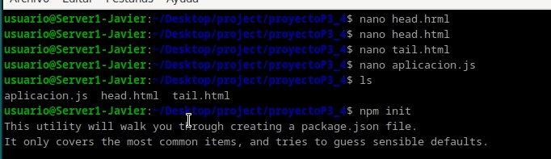

ahora ejecutamos la aplicación con el comando:

```bash 
node aplicacion.js
```

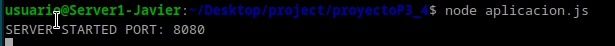

y como podemos ver la aplicación se ejecuta correctamente.

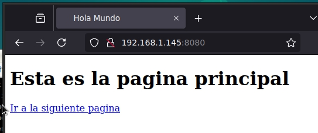

### 2. Despliegue de la aplicación en Netlify

En una nueva carpeta de proyecto, clonamos de github el repositorio para realizar la practica.
Nota, inicializar el reposititrio en la carpeta correcta

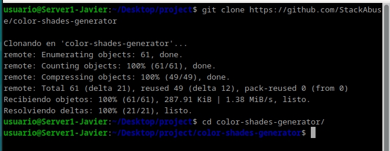

Ahora debemos instalar las dependencias de la aplicación dentro de la carpeta con el comando:

```bash
npm install netlify-cli -g
```

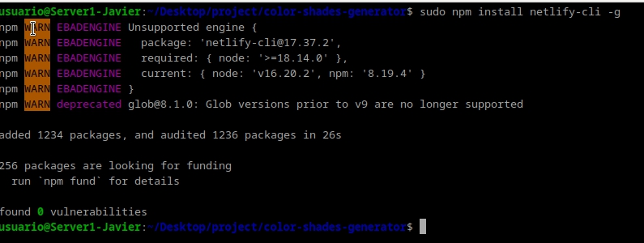

Ahora debemos loguearnos en netlify con el comando. pero no debemos iniciar sesion con github
```bash
netlify login
```
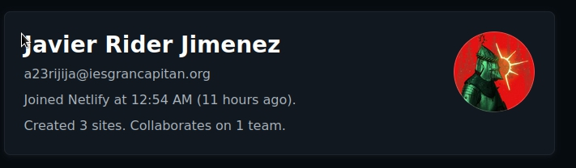


Ahora debemos desplegar la aplicación con el comando:

```bash
netlify deploy
```

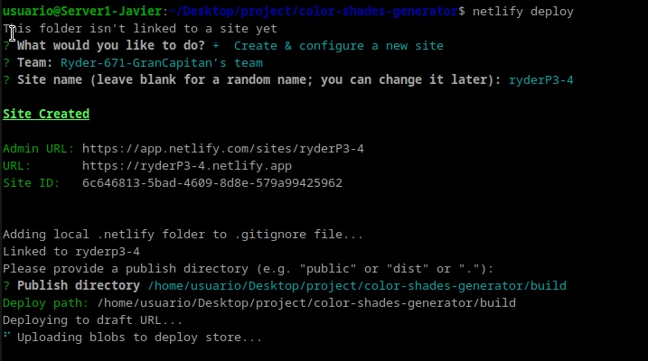
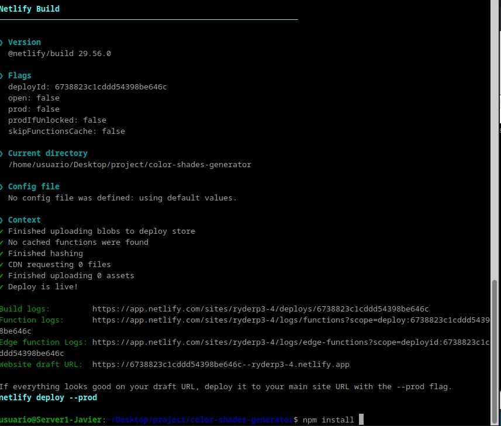

con el enlace que nos proporciona netlify podemos acceder a la aplicación desplegada.

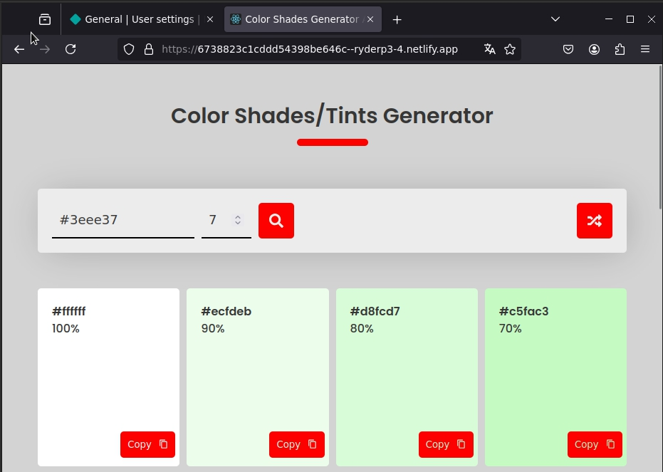

y como podemos ver la aplicación se ha desplegado correctamente.

### 3. Proceso de despliegue en Netlify

En la pagina de netlify, debemos conseguir un token de autenticación para poder desplegar la aplicación. con el siguiente comando podemos aplicar el token en la terminal.


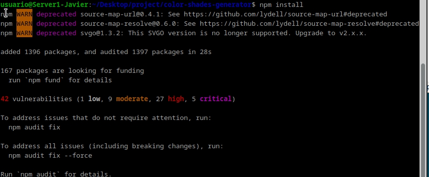


Ahora debemos borrar la aplicación que hemos creado antes para evitar conflictos con el despliegue de la nueva aplicación.

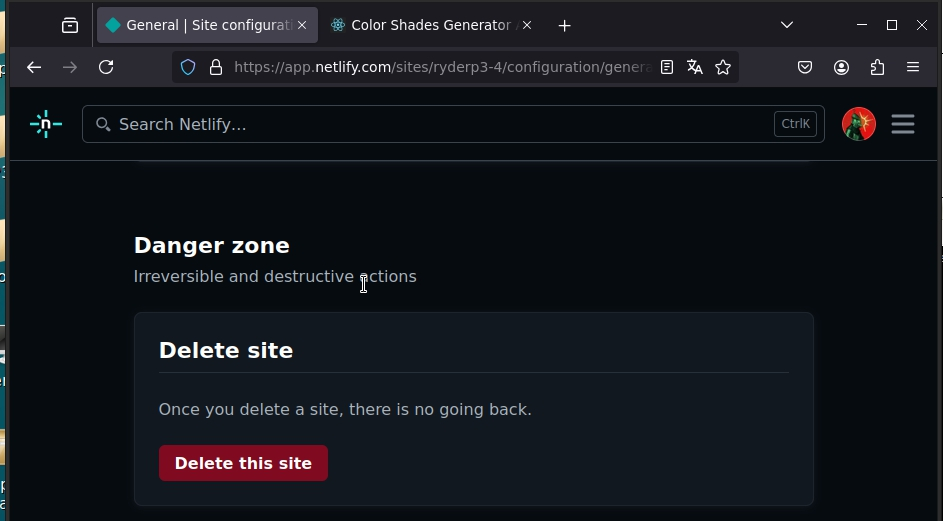

y ademas borramos la carpeta de la aplicación que hemos creado antes.

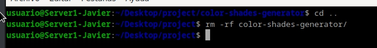


ahora nos descargamos el repositorio de la aplicación que vamos a desplegar en netlify en formaoto .zip con el siguiente comando

```bash
wget https://github.com/StackAbuse/color-shades-generator/archive/refs/heads/main.zip
```

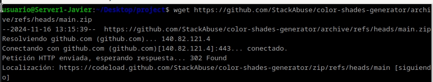

Creamos la carpeta de la aplicación y descomprimimos el archivo .zip en la carpeta con el siguiente comando. Atencion a que se descomprime en la carpeta correcta.

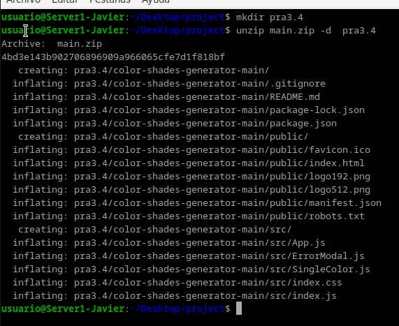


Tambien debemos crear un repositorio en github para poder desplegar la aplicación en netlify. Donde debemos subir el contenido de la carpeta de la aplicación.

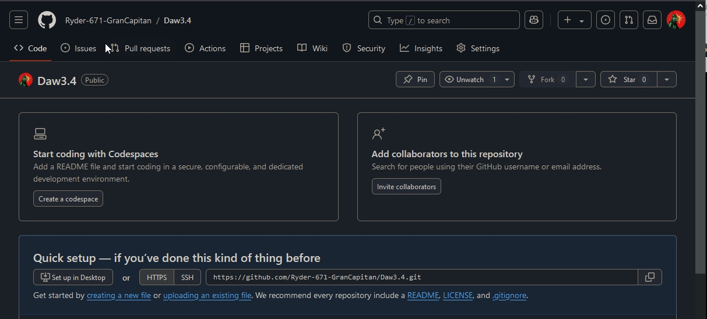

Ahora debemos enlazar github con netlify para poder desplegar la aplicación.

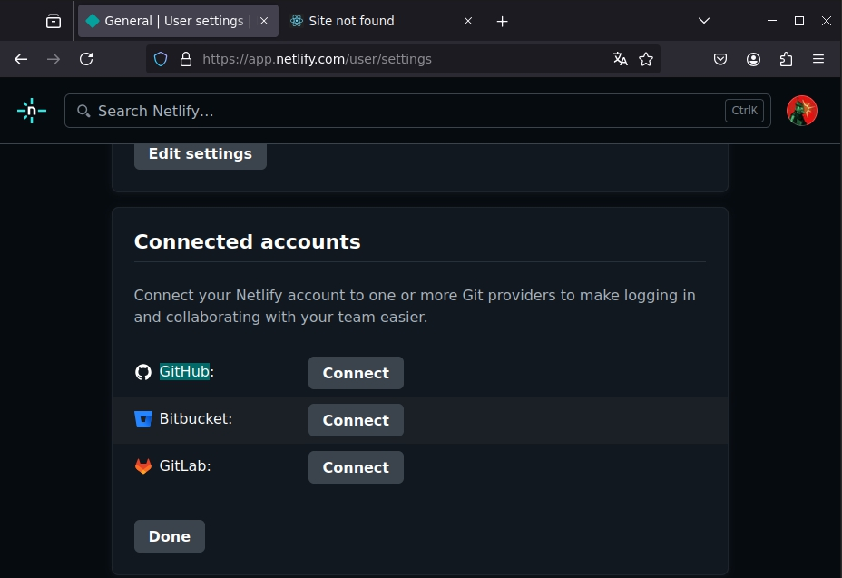
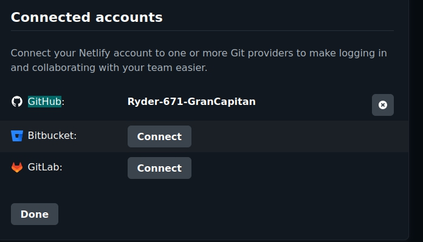

Debemos enlazarlo exclusivamente con el repositorio de la aplicación.

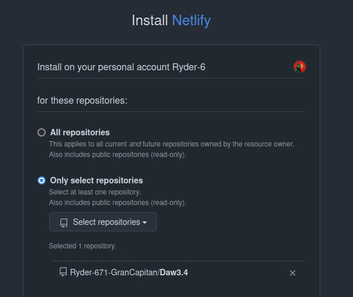

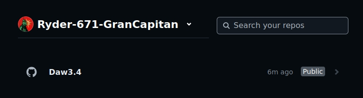

Ahora vamos a desplegar la aplicación en netlify dandole nombre, no necesitamos modificar nada 

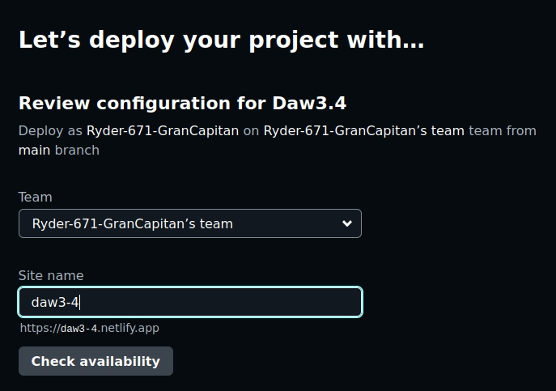

desplegamos la aplicación

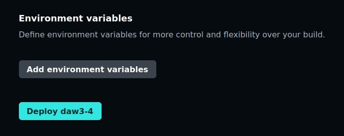

tras unos minutos podremos acceder a la aplicación desplegada en netlify.

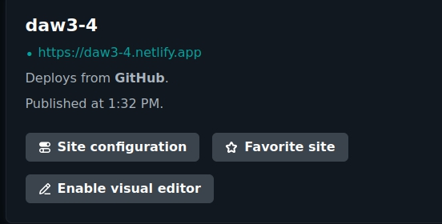
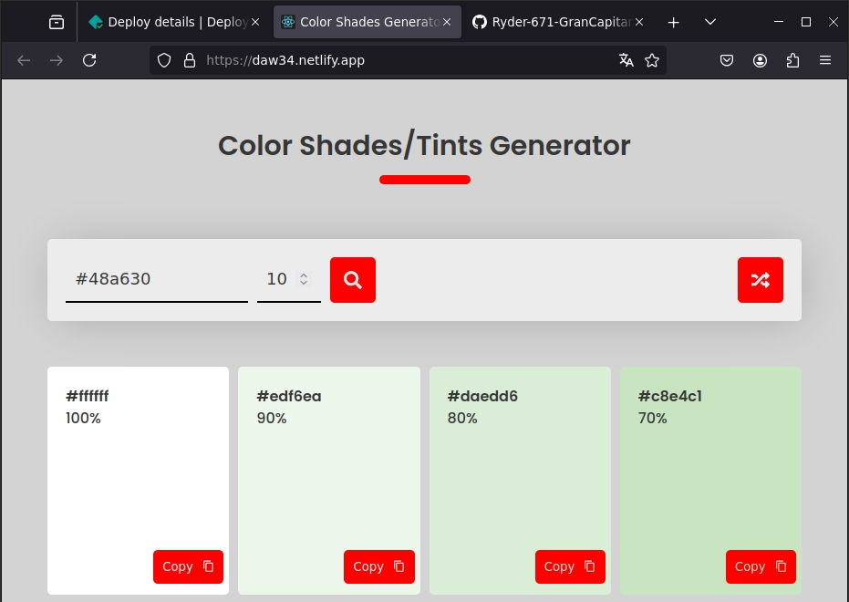

por ultimo modificamos robots.txt para que no se indexe la pagina en los motores de busqueda.

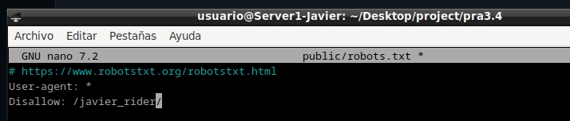
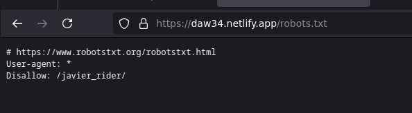


