# Práctica 3.5
## Configuración de un servidor Nginx con Hosts Virtuales y directorios de usuario
#### Javier Rider Jimenez

### 0. Preparativos
Primero que nada debemos asegurarnos de tener ssh en nuestra maquina fisica

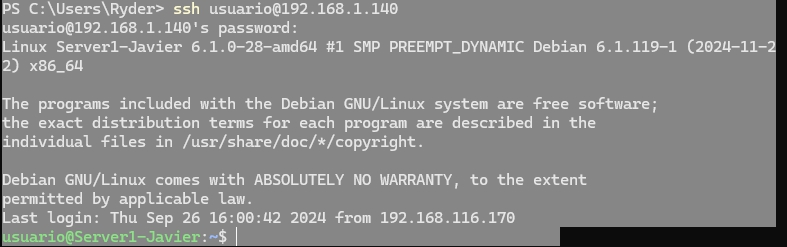

### 1. Creación de usuarios

Añadimos 2 usuarios `pepe` y `anton` con el comando `sudo adduser -m -s /bin/bash pepe` y `sudo adduser -m -s /bin/bash anton` junto a su respectiva contraseña `passwd pepe` y `passwd anton`.


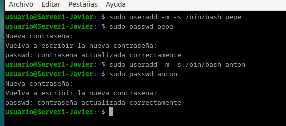


### 2.1 Usuario Pepe

Dado que tendremos que configurar el servidor para cada usuario vamos a hacer primero 1 y luego otro. Iniciamos sesión con el usuario `pepe` 

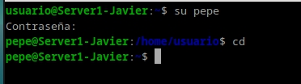

Creamos su carpeta, configurando los permisos de la carpeta

```bash
setfacl -d -R -m u:www-data:rwx public_html
getfacl public_html
```

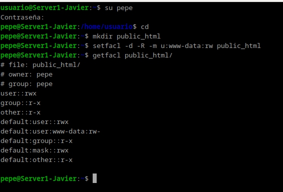

Dentro de esta carpeta un index.html, que contenga una pequeña pagina web. Con diferencias a la que mas tarde haremos con anton 

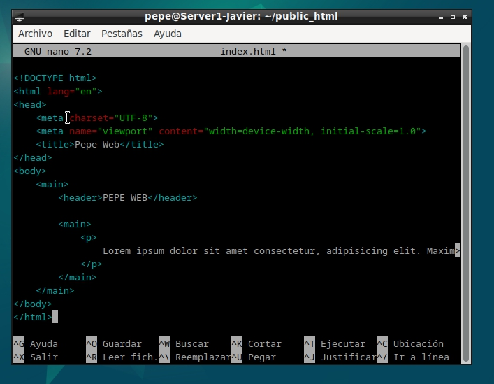

### 2.2 Nginx

Dado que ya hemos instalado multiples veces nginx a lo largo de las practicas no considero relveante volver a explicar como instalarlo. 

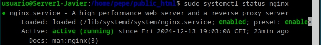

### 2.3 Https Pepe

De vuelva con el usuario princial, generamos un certificado autofirmado 

```bash
sudo openssl req -x509 -nodes -days 365 -newkey rsa:2048 -keyout /etc/ssl/private/pepe.pem -out /etc/ssl/certs/pepe.pem
```

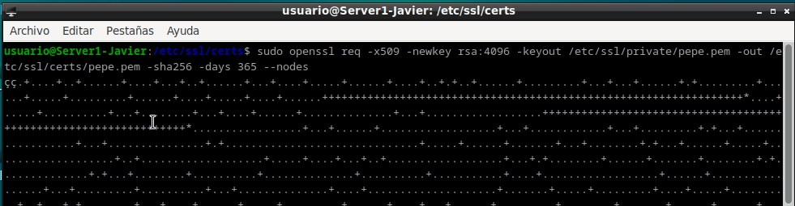

### 2.4 Configuración de Nginx 

Creamos un archivo de configuración en `/etc/nginx/sites-available/pepe` con el siguiente contenido

Primeramente la redirection de http a https

```bash

server {
    listen 80;
    listen [::]:80;
    server_name pepe.es;

    location / {
        return 301 https://$server_name$request_uri;
    }   
}
```

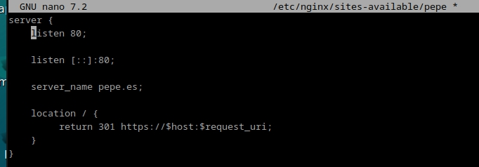

y a continuación la configuración para https

```bash
server {
    listen 443 ssl;
    listen [::]:443 ssl;
    server_name pepe.es;

    ssl_certificate /etc/ssl/certs/pepe.pem;
    ssl_certificate_key /etc/ssl/private/pepe.pem;

    root /home/pepe/public_html;
    index index.html;
    location / {

        try_files $uri $uri/ =404;
    }
}
```
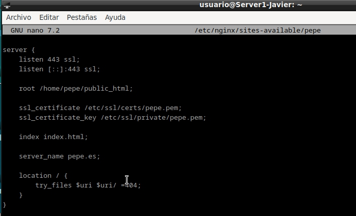

Ahora que esta el archivo creado, lo enlazamos a sites-enabled 


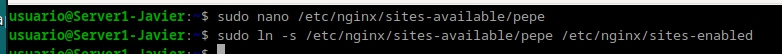

Por ultimo pasado el test de configuración reiniciamos el servicio

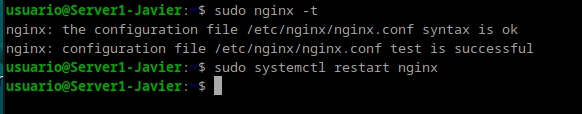

### 2.5 Comprobación

como breve inciso, debemos añadir la ip actual a nuestro archivo de hosts junto a los dominios 

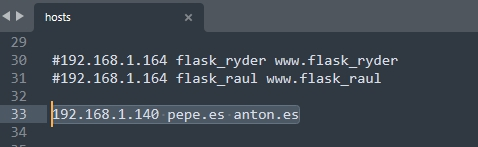

Y ahora al poner pepe.es vemos la pagina web de pepe, ademas de tener lo permisos auto firmados y la redirección de http a https

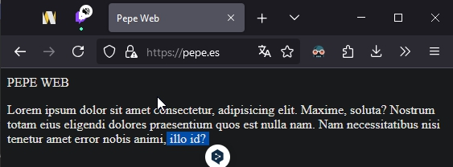

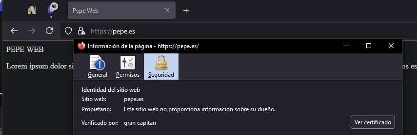


### 3.1 Usuario Anton

Ahora repetimos el proceso con el usuario `anton`. Dado que las instrucciones son las mismas, solo mostrare las capturas del proceso y el resultado final

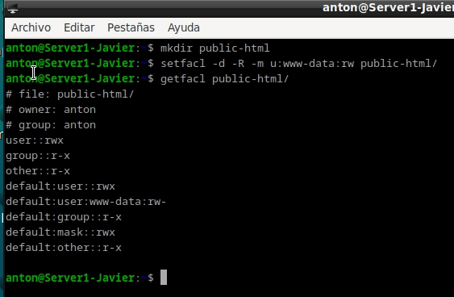

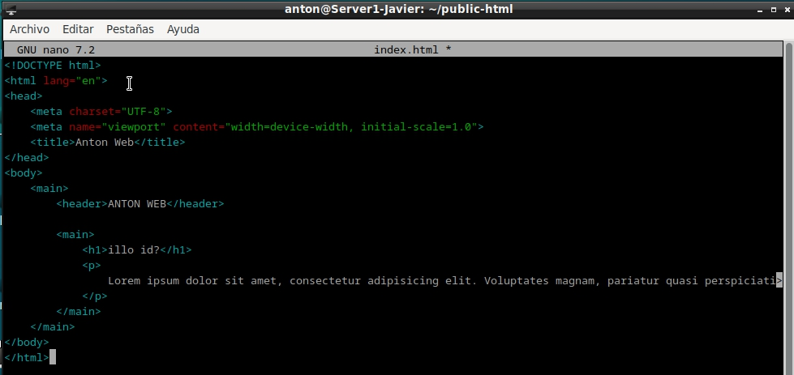

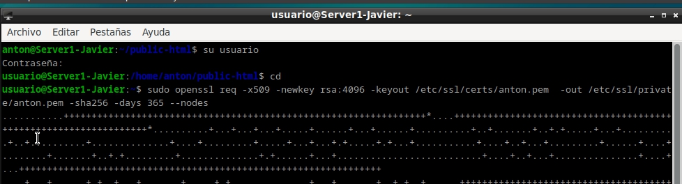

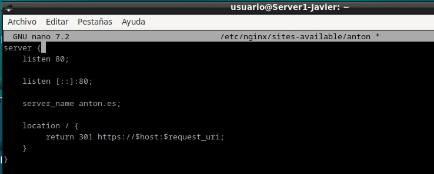

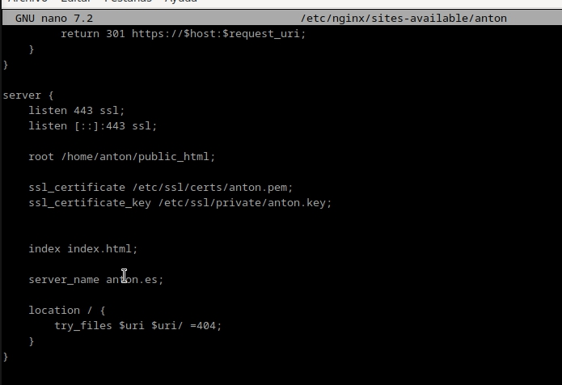

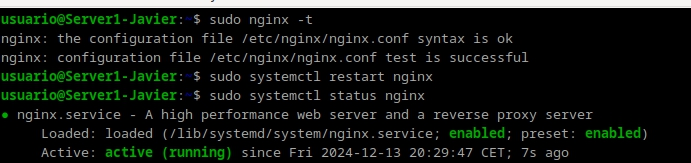

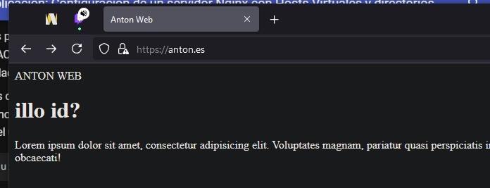

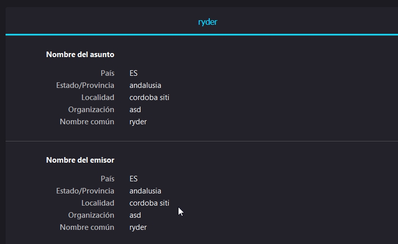
