# Práctica 4.1
## Configuración de un servidor DN
#### Javier Rider Jimenez

### 0. Preparativos

Vamos a hacer todo el proceso a traves de ssh

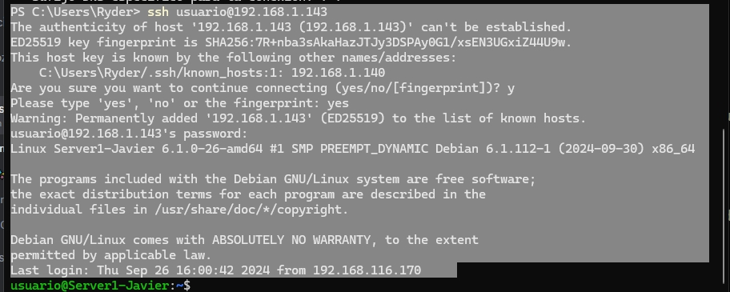

### 1. Instalación de servidor DNS

Instalar los servicios necesarios

```bash
sudo apt-get install bind9 bind9utils bind9-doc 
```

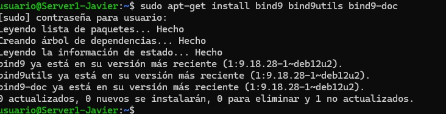

### 2. Configuración del servidor DNS

Vamos a configurar el servidor DNS para que resuelva los nombres de los equipos de la red local.

```bash
sudo nano /etc/default/named
```

debemos añadir a named lo siguiente para que solo use ipv4

```bash
OPTIONS="-u bind -4"
```

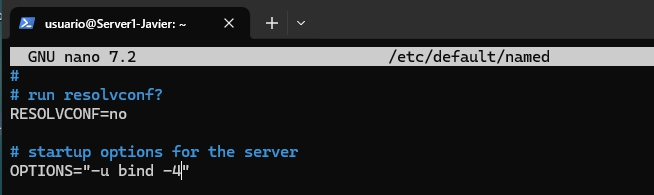


el archivo de configuración de bind9 es /etc/bind/named.conf que debera verse tal como en la imagen

```bash
sudo nano /etc/bind/named.conf
```

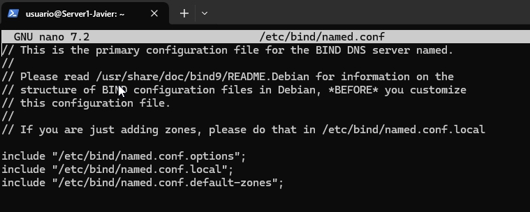


### 3. configuración named.conf.options

Hacemos una copia de seguridad del fichero que vamos a modificar, por si algo sale mal.

```bash
sudo cp /etc/bind/named.conf.options /etc/bind/named.conf.options.backup
```

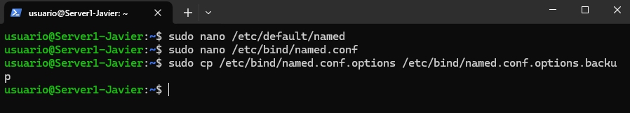

Editamos el fichero named.conf.options

```bash
sudo nano /etc/bind/named.conf.options
```

por motivo de seguridad se añade una lista de ip autoriazadas a consultar el servidor DNS

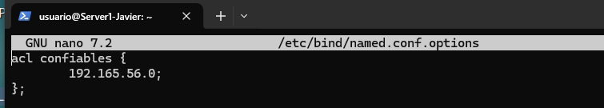

tambien debemos añadir las siguientes lineas para que el servidor DNS pueda resolver nombres de dominio

```bash
allow-recursion { confiables; };
allow-transfer { none; };
listen-on port 53 { 192.165.1.143; };
```

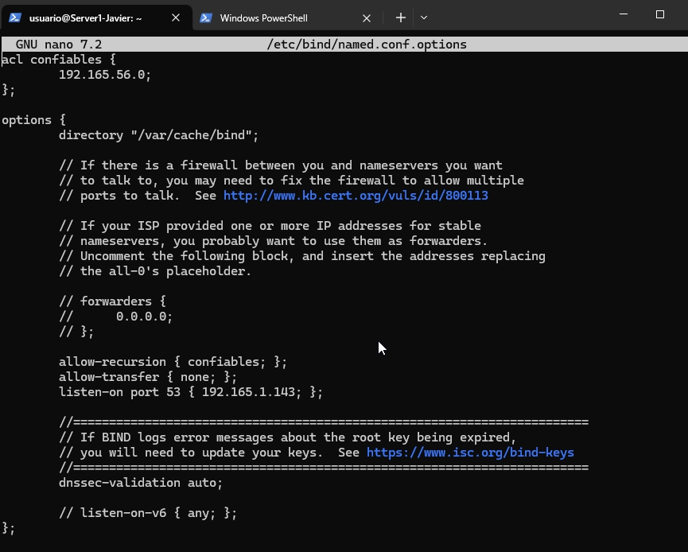

Nos aseguramos de que el archivo no tiene errores de sintaxis y ademas reiniciamos el servicio

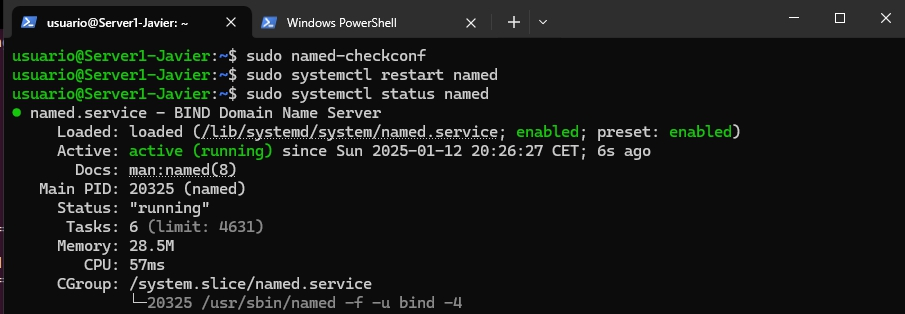

modificamos el archivo named.conf.local para añadir la zona de resolución directa


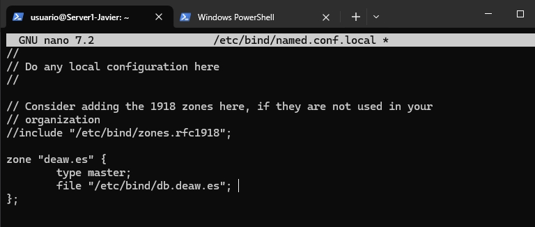


### 4. Configuración de la zona de resolución inversa

Creamos el archivo db.deaw.es, que contendrá la información de la zona de resolución inversa.

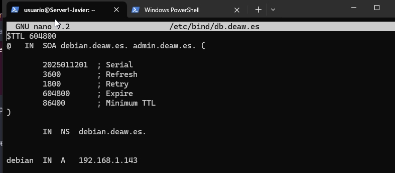

modificamos el archivo named.conf.local para añadir la zona de resolución inversa


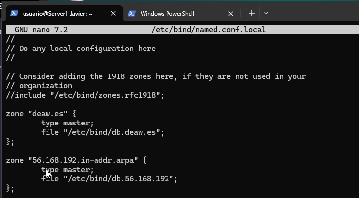

y creamos el archivo db.192.168.1 que contendra la informacion de la zona de resolucion directa


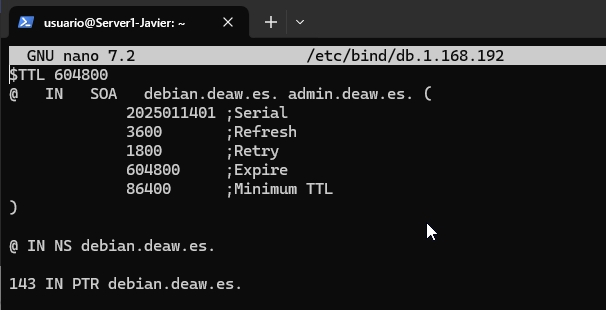

### 5. Comprobaciones

Comprobamos que el servidor DNS resuelve los nombres de los equipos de la red local. Tanto de forma directa como inversa.

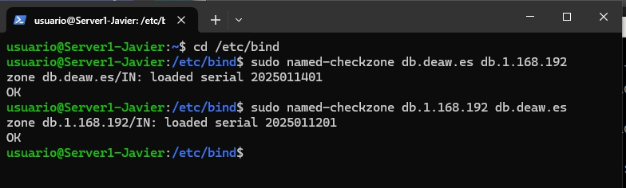

reiniciamos el servicio y comprobamos que todo funciona correctamente

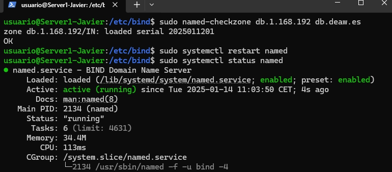

Modificamos el archivo /etc/resolv.conf de una maquina cliente para que apunte a nuestro servidor DNS

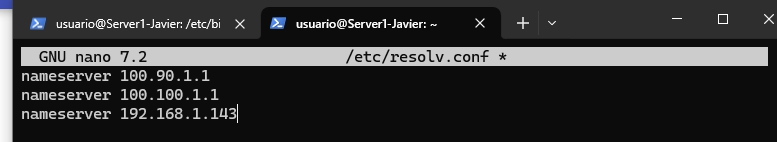

### 6. Resultado

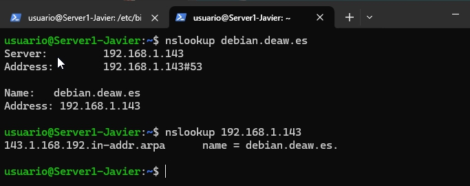

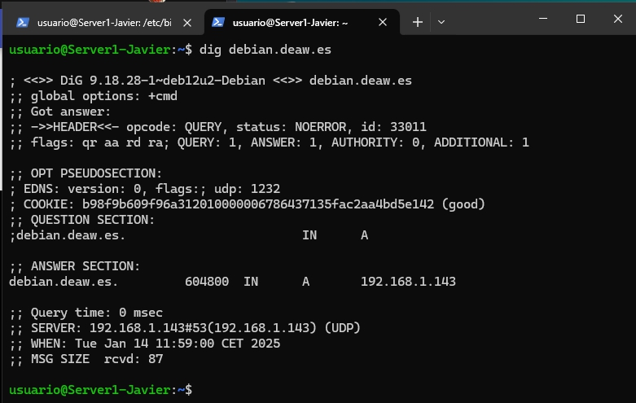

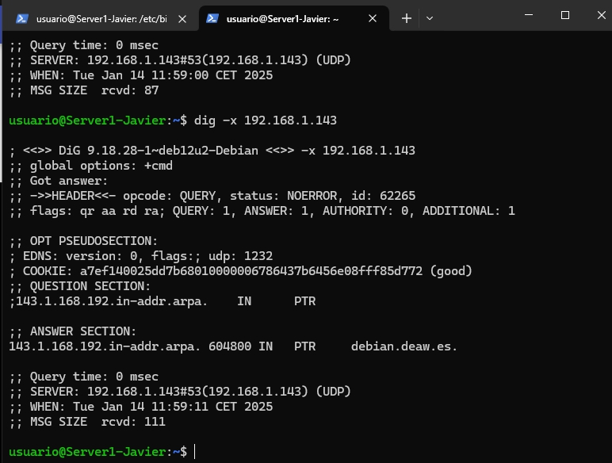

### 7. Cuestiones

#### Cuestión 1
¿Qué pasará si un cliente de una red diferente a la tuya intenta hacer uso de tu DNS de alguna manera, le funcionará?¿Por qué, en qué parte de la configuración puede verse?

No, solo funcionará si está permitido en la configuración, específicamente en la directiva allow-query, que define qué clientes pueden realizar consultas.

#### Cuestión 2
¿Por qué tenemos que permitir las consultas recursivas en la configuración?

Para resolver nombres de dominios que el servidor no controla, utilizando otros servidores DNS para obtener la información.

#### Cuestión 3
El servidor DNS que acabáis de montar, ¿es autoritativo?¿Por qué?

Sí, si tiene configuradas zonas con datos autoritativos para ciertos dominios. Si no, no es autoritativo.

#### Cuestión 4
¿Dónde podemos encontrar la directiva $ORIGIN y para qué sirve?

Se encuentra en los archivos de zona y sirve para definir el dominio base que se aplicará a los registros dentro de ese archivo.

#### Cuestión 5
¿Una zona es idéntico a un dominio?

No, una zona es una parte de un dominio, pero un dominio puede abarcar varias zonas.

#### Cuestión 6
¿Pueden editarse los archivos de zona de un servidor esclavo/secundario?

No, los archivos de zona en un servidor esclavo son replicados desde el maestro y no se pueden editar directamente.

#### Cuestión 7
¿Por qué podría querer tener más de un servidor esclavo para una misma zona?

Para garantizar redundancia, balancear la carga y aumentar la disponibilidad del servicio DNS.

#### Cuestión 8
¿Cuántos servidores raíz existen?

Hay 13 servidores raíz distribuidos globalmente, identificados como letras de la A a la M.

#### Cuestión 9
¿Qué es una consulta iterativa de referencia?

Una consulta iterativa devuelve referencias a otros servidores DNS, permitiendo que el cliente continúe la resolución.

#### Cuestión 10
En una resolución inversa, ¿a qué nombre se mapearía la dirección IP 172.16.34.56?

La dirección IP 172.16.34.56 se mapearía a 56.34.16.172.in-addr.arpa mediante un archivo de zona de resolución inversa.

