# Práctica 5.1
## Configuración de un servidor DN
#### Javier Rider Jimenez

### Repositorio DEAW
1. Crear un repositorio en GitHub .
2. Clonar repositorio en local.

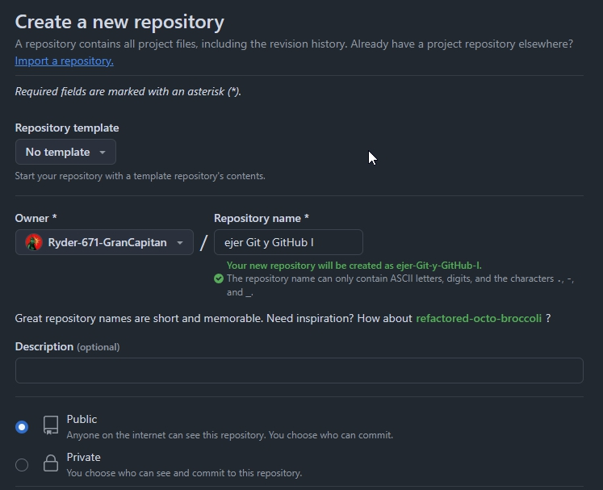

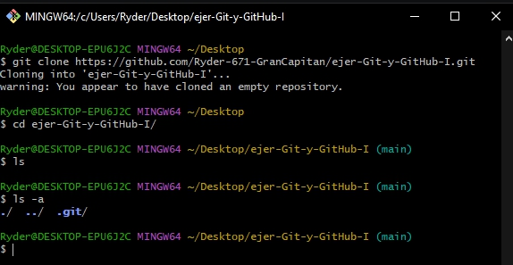

### README
1. Crear README.md.

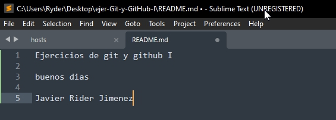

### Commit inicial
1. Realizar un commit inicial.

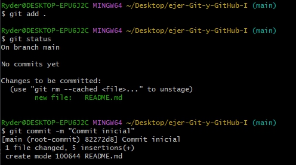


### Push inicial
1. Subir los cambios al repositorio remoto.

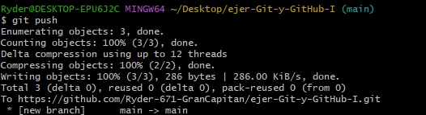

### Ignorar archivos
1. Crear fichero `privado.txt`.
2. Crear carpeta `privada`.
3. Añadir `.gitignore` para ignorar los ficheros creados.
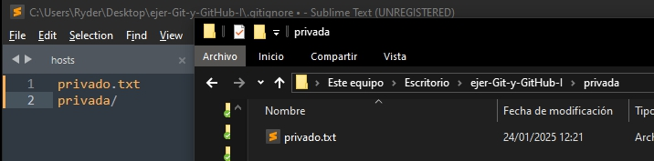
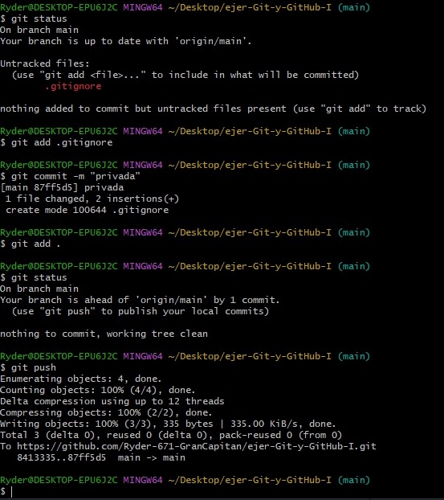
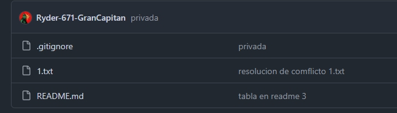

### Añadir fichero 1.txt
1. Añadir fichero `1.txt` al repositorio local.

```bash
echo "Hola" > 1.txt
git add 1.txt
git commit -m "Añadido fichero 1.txt"
git push
```

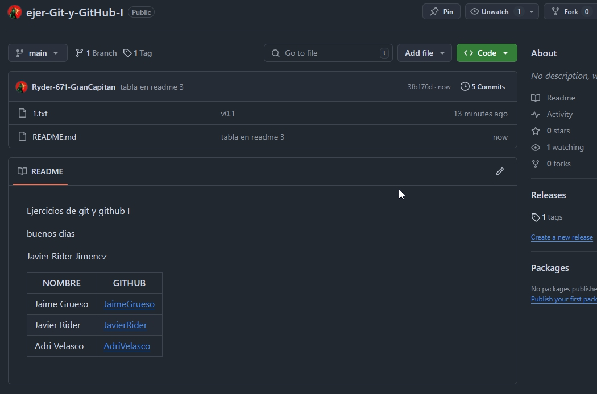

### Crear el tag v0.1
1. Crear un tag `v0.1`.
2. Subir los cambios al repositorio remoto.

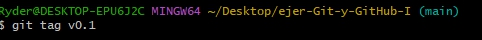

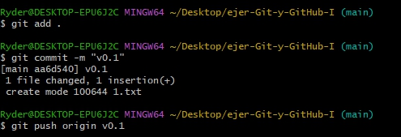

### Uso social de GitHub
1. Preguntar los nombres de usuario de GitHub de 2 de tus compañeros de clase, búscalos, y sígueles.
2. Seguir los repositorios DEAW del resto de tus compañeros.
3. Añadir una estrella a los repositorios DEAW del resto de tus compañeros.

no he considerado en hacer este apartado 

### Crear una tabla
Crear una tabla de este estilo en el fichero README.md con la información de varios de tus compañeros de clase:


## Colaboradores
Poner a [github.com/raul-profesor](https://github.com/raul-profesor) como colaborador del repositorio DEAW.

## Notas
Este ejercicio es continuación del anterior por lo que tendréis que seguir trabajando en el repositorio DEAW.

También tendréis que ir poniendo los comandos que habéis tenido que utilizar durante todos los ejercicios y las explicaciones y capturas de pantalla que consideréis necesarias en el informe.

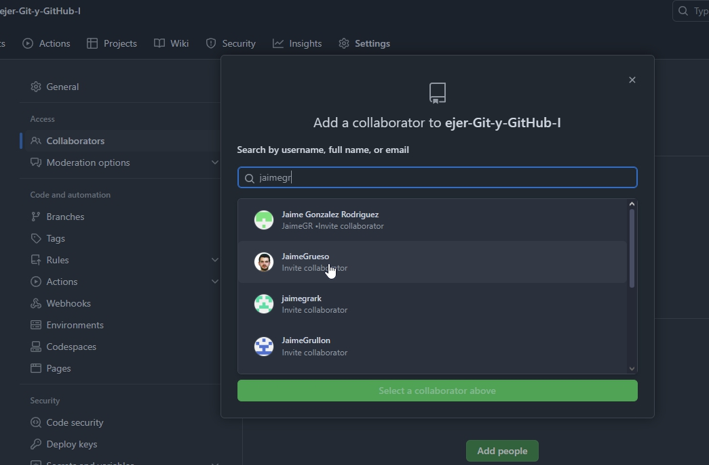

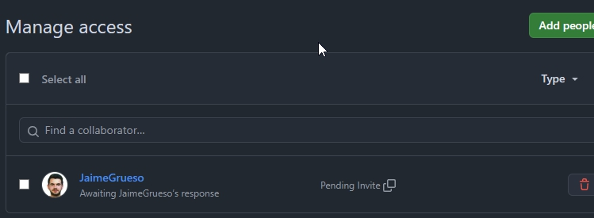

## Crear una rama v0.2
1. Crear una rama `v0.2`.
2. Posiciona tu carpeta de trabajo en esta rama.

```bash
git branch v0.2
git checkout v0.2
```

## Añadir fichero 2.txt
1. Añadir un fichero `2.txt` en la rama `v0.2`.

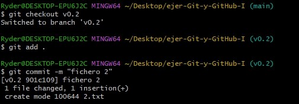

## Crear rama remota v0.2
1. Subir los cambios al repositorio remoto.

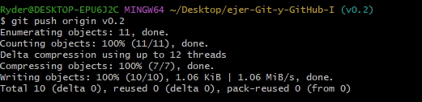

## Merge directo
1. Posicionarse en la rama `main`.
2. Hacer un merge de la rama `v0.2` en la rama `main`.

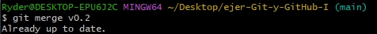

## Merge con conflicto
1. En la rama `main` poner `Hola` en el fichero `1.txt` y hacer commit.
2. Posicionarse en la rama `v0.2` y poner `Adios` en el fichero `1.txt` y hacer commit.
3. Posicionarse de nuevo en la rama `main` y hacer un merge con la rama `v0.2`.
4. Arreglar el conflicto anterior y hacer un commit.

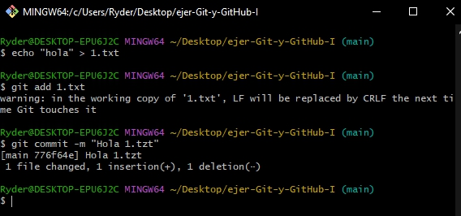

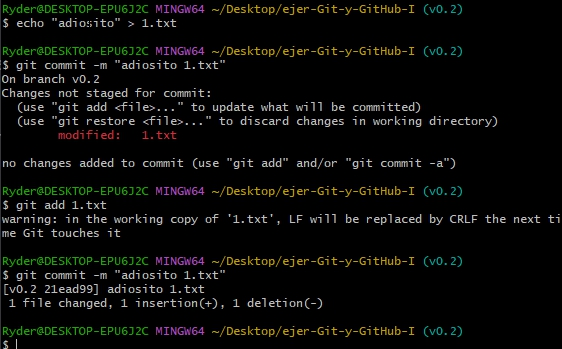

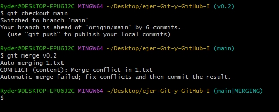

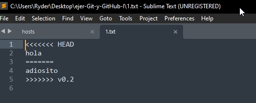

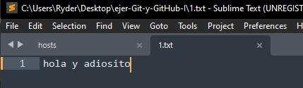

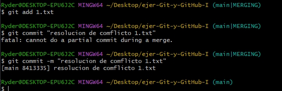

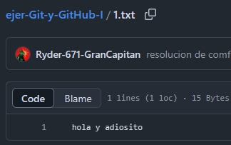

## Listado de ramas
1. Listar las ramas con merge y las ramas sin merge.
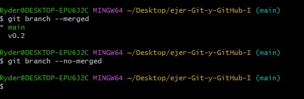

## Arreglar conflicto

## Borrar rama
1. Crear un tag `v0.2`.
2. Borrar la rama `v0.2`.
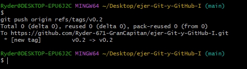
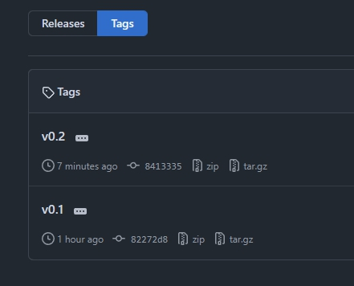
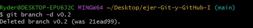
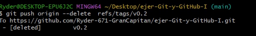

## Listado de cambios
1. Listar los distintos commits con sus ramas y sus tags.

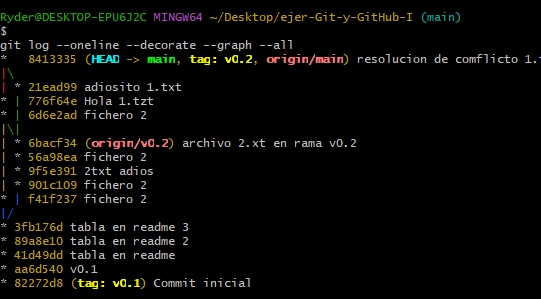
