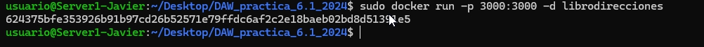

# Práctica 6.1
## Ejercicios de Docker 
#### Javier Rider Jimenez

### **Dockerización del despliegue de una aplicación Node.js**

#### 0. Conexión ssh

conexión ssh con la máquina virtual


#### 1. Despliegue con Docker

Clonar el repositorio de la aplicación


Antes de continuar, instalar Docker


**Recomendacion**
*siempre hacer una copia de los ficheros de configuración de Docker antes de actualizarlos, los doy por echos y el repositorio de la aplicacion ya contiene copias*

Completar el Dockerfile con las propiedades indicadas para esta aplicación

````bash

# Usamos la imagen base de Node.js versión 18 con Alpine (versión ligera)
FROM node:18.16.0-alpine3.17

# Establecemos el directorio de trabajo dentro del contenedor
WORKDIR /opt/app

# Creamos el directorio donde se instalarán las dependencias
RUN mkdir -p /opt/app

# Copiamos los archivos package.json y package-lock.json al contenedor
COPY src/package.json src/package-lock.json ./

# Instalamos las dependencias de la aplicación
RUN npm install

# Copiamos el resto de los archivos de la carpeta src al contenedor
COPY src/ ./

# Exponemos el puerto 3000 para la aplicación
EXPOSE 3000

# Comando para ejecutar la aplicación en modo desarrollo
CMD ["npm", "run", "start:dev"]
````


Creamos la build del contenedor. Esta es librodirecciones

```bash
sudo docker build -t librodirecciones .
```


Ejecutamos el contenedor, con esto se levanta el servidor y se puede acceder a la aplicación

```bash
sudo docker run -d -p 3000:3000 librodirecciones
```



si todo hay ido bien al ir a la dirección http://localhost:3000/ debería aparecer un error


#### 2. Despliegue con Docker Compose
Crear el archivo docker-compose.yml. El git proporcionado ya lo contiene¡


Instalar docker-compose


ejecutar el docker-compose
```bash
sudo docker run -p 3000:3000 librodirecciones
```


levantar el contenedor


pruebas de funcionamiento


Instalar curl para hacer pruebas de funcionamiento


Para el correcto funcionamiento es necesario modificar package.json, añadiendo la siguiente línea

```bash
"start:dev": "star bin/www"
```


añadir un nuevo elemento a la aplicación


mostrar 1 elemento de la aplicación


borrar 1 elemento de la aplicación


