# Práctica 6.2
## Ejercicios de Docker 
#### Javier Rider Jimenez

### **Despliegue de una aplicación PHP con Nginx y MySQL usando Docker y docker-compose**

#### 0. Conexión ssh

conexión ssh con la máquina virtual

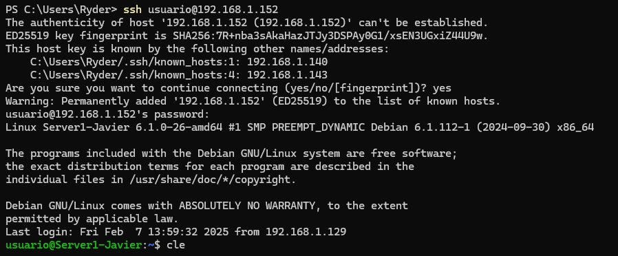

#### 1. Estructura de la aplicación

/usuario/home/practica6-2/
├── docker-compose.yml
├── nginx
│   ├── default.conf
│   └── Dockerfile
├── php
│   └── Dockerfile
└── www
    └── html
        └── index.php

        

```bash
mkdir -p /usuario/home/practica6-2/nginx /usuario/home/practica6-2/php /usuario/home/practica6-2/www/html

touch /usuario/home/practica6-2/docker-compose.yml
touch /usuario/home/practica6-2/nginx/default.conf
touch /usuario/home/practica6-2/nginx/Dockerfile
touch /usuario/home/practica6-2/php/Dockerfile
touch /usuario/home/practica6-2/www/html/index.php
```

Crear la estructura basica de la aplicación, añadiremos mas
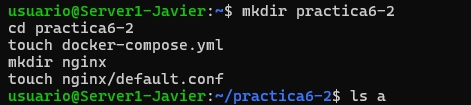

#### 2. Creación de contenedor de Nginx

Creamos el archivo docker-compose.yml con este contenido inicialmente

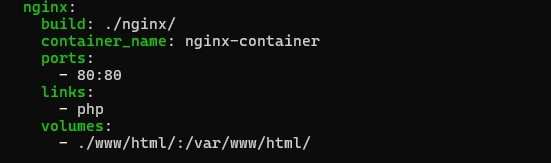

Ahora levantamos el contenedor y verificamos que funciona

```bash
sudo docker-compose up -d
sudo docker ps
```
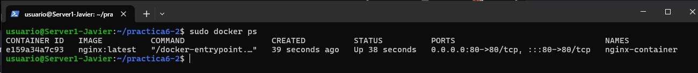

Si todo esta correcto, podemos ver la pagina de bienvenida de Nginx

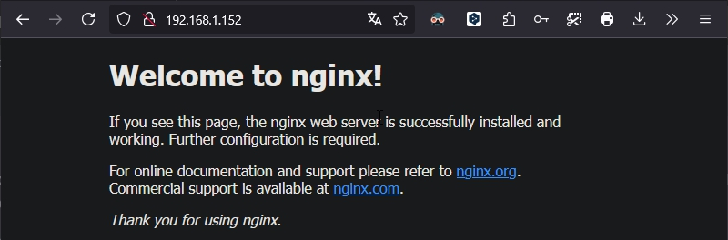

#### 3. Creación de contenedor de PHP

creamos la carpeta en caso de no haberla creado antes y  creamos el archivo index.php

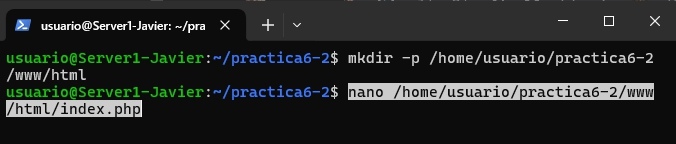

y añadimos el contenido del archivo index.php

```php
<!DOCTYPE html>
<head>
  <title>¡Hola mundo!</title>
</head>

<body>
  <h1>¡Hola mundo!</h1>
  <p><?php echo 'Estamos corriendo PHP, version: ' . phpversion(); ?></p>
</body>
</html>
```

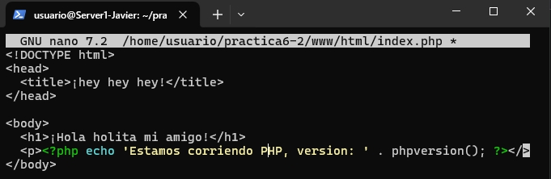

Creamos el archivo de configuración de Nginx

```bash
sudo nano /usuario/home/practica6-2/nginx/default.conf
```
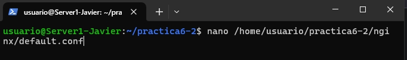
y añadimos el siguiente contenido

```bash
server {

     listen 80 default_server;
     root /var/www/html;
     index index.html index.php;

     charset utf-8;

     location / {
      try_files $uri $uri/ /index.php?$query_string;
     }

     location = /favicon.ico { access_log off; log_not_found off; }
     location = /robots.txt { access_log off; log_not_found off; }

     access_log off;
     error_log /var/log/nginx/error.log error;

     sendfile off;

     client_max_body_size 100m;

     location ~ .php$ {
      fastcgi_split_path_info ^(.+.php)(/.+)$;
      fastcgi_pass php:9000;
      fastcgi_index index.php;
      include fastcgi_params;
      fastcgi_param SCRIPT_FILENAME $document_root$fastcgi_script_name;
      fastcgi_intercept_errors off;
      fastcgi_buffer_size 16k;
      fastcgi_buffers 4 16k;
    }

     location ~ /.ht {
      deny all;
     }
    }
```

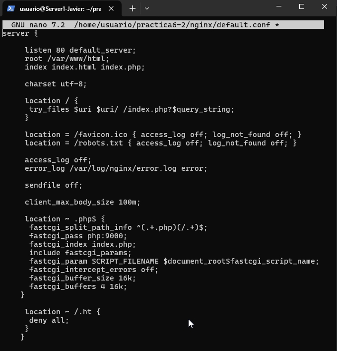

Creamos el archivo Dockerfile de Nginx con el siguiente contenido

```bash
sudo nano /usuario/home/practica6-2/nginx/Dockerfile
```

````bash
FROM nginx:latest
COPY ./default.conf /etc/nginx/conf.d/default.conf
````
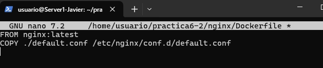

editamos el archivo docker-compose.yml con este contendio, aqui añadimos la parte de php
```bash
services:
  nginx:
    build: ./nginx/
    container_name: nginx-container
    ports:
      - 80:80
    links:
      - php
    volumes:
      - ./www/html/:/var/www/html/

  php:
    image: php:7.0-fpm
    container_name: php-container
    expose:
      - 9000
    volumes:
      - ./www/html/:/var/www/html/
```

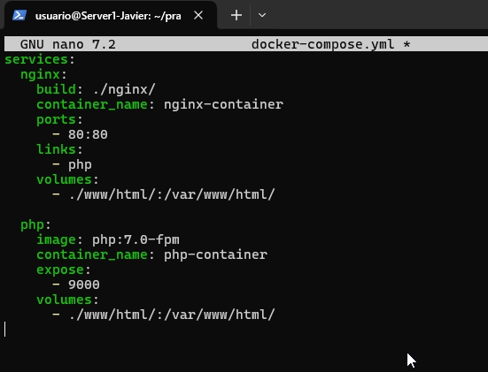

Levantamos los contenedores

```bash
sudo docker-compose up -d
sudo docker ps
```
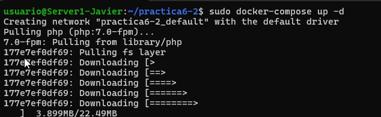
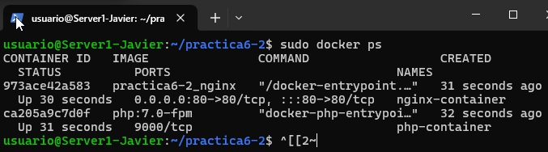

Si todo esta bien, podemos ver la pagina de bienvenida de php

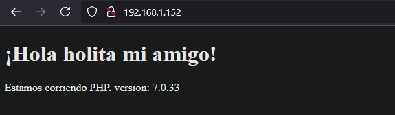

#### 4. Creación de contenedor para datos 

Editamos el archivo docker-compose.yml con este contenido

```bash
nginx:
  build: ./nginx/
  container_name: nginx-container
  ports:
    - 80:80
  links:
    - php
  volumes_from:
    - app-data

php:
  image: php:7.0-fpm
  container_name: php-container
  expose:
    - 9000
  volumes_from:
    - app-data

app-data:
  image: php:7.0-fpm
  container_name: app-data-container
  volumes:
    - ./www/html/:/var/www/html/
  command: "true"
``` 

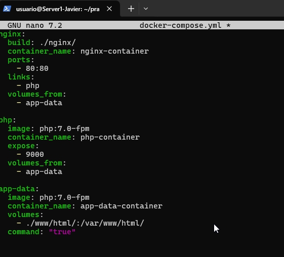

Levantamos los contenedores

```bash
sudo docker-compose up -d
sudo docker ps
```
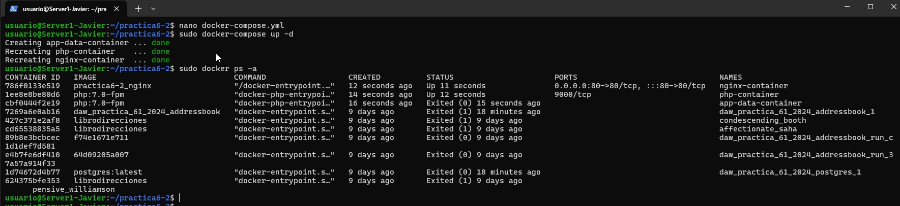
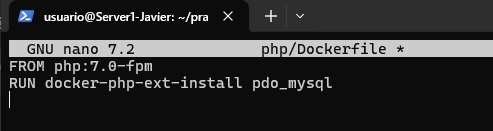

#### 5. Creación de contenedor de MySQL

Creamos el archivo dockerfile de MySQL con el contenido

```bash
FROM php:7.0-fpm
RUN docker-php-ext-install pdo_mysql
```

y actualizamos el archivo docker-compose.yml

```bash
services:
  nginx:
    build: ./nginx/
    container_name: nginx-container
    ports:
      - 80:80
    links:
      - php
    volumes_from:
      - app-data
  php:
    build: ./php/
    container_name: php-container
    expose:
      - 9000
    links:
      - mysql
    volumes_from:
      - app-data

  app-data:
    image: php:7.0-fpm
    container_name: app-data-container
    volumes:
      - ./www/html/:/var/www/html/
    command: "true"

  mysql:
    image: mysql:5.7
    container_name: mysql-container
    volumes_from:
      - mysql-data
    environment:
      MYSQL_ROOT_PASSWORD: secret
      MYSQL_DATABASE: mydb
      MYSQL_USER: myuser
      MYSQL_PASSWORD: password

  mysql-data:
    image: mysql:5.7
    container_name: mysql-data-container
    volumes:
      - /var/lib/mysql
    command: "true"
```


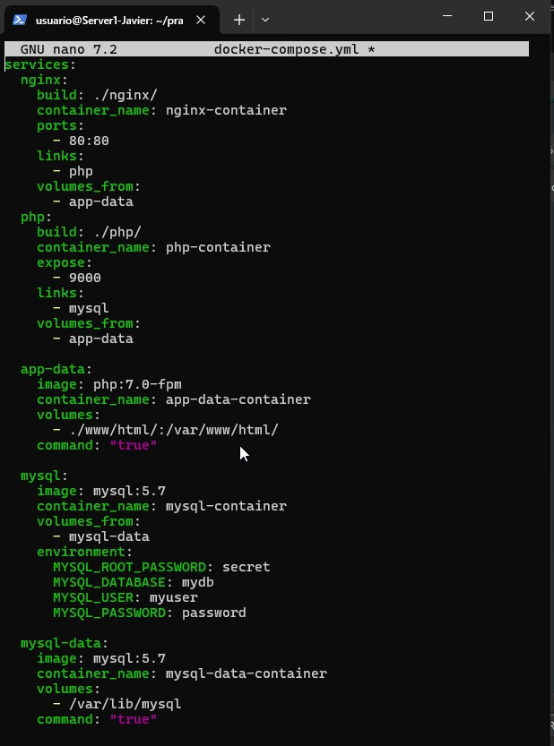

y el index.php

```php
     <!DOCTYPE html>
     <head>
      <title>¡Hola mundo!</title>
     </head>

     <body>
      <h1>¡Hola mundo!</h1>
      <p><?php echo 'Estamos corriendo PHP, version: ' . phpversion(); ?></p>
      <?
       $database ="mydb";
       $user = "myuser";
       $password = "password";
       $host = "mysql";

       $connection = new PDO("mysql:host={$host};dbname={$database};charset=utf8", $user, $password);
       $query = $connection->query("SELECT TABLE_NAME FROM information_schema.TABLES WHERE TABLE_TYPE='BASE TABLE'");
       $tables = $query->fetchAll(PDO::FETCH_COLUMN);

        if (empty($tables)) {
          echo "<p>No hay tablas en la base de datos \"{$database}\".</p>";
        } else {
          echo "<p>La base de datos \"{$database}\" tiene las siguientes tablas:</p>";
          echo "<ul>";
            foreach ($tables as $table) {
              echo "<li>{$table}</li>";
            }
          echo "</ul>";
        }
        ?>
    </body>
</html>
```

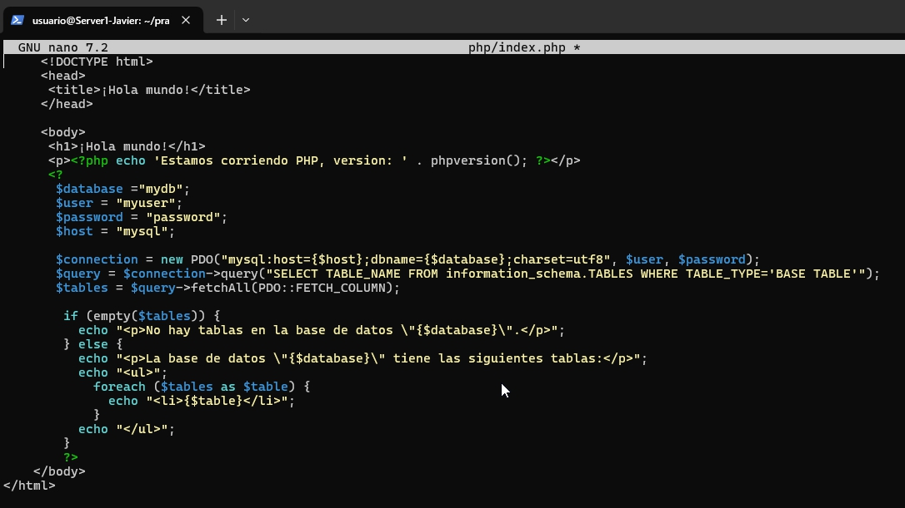

Levantamos los contenedores

```bash
sudo docker-compose up -d
sudo docker ps
```
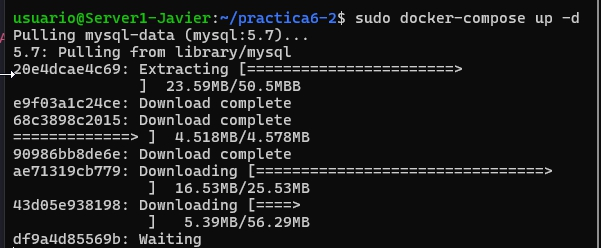

Deberá verse de esta manera si todo esta correcto
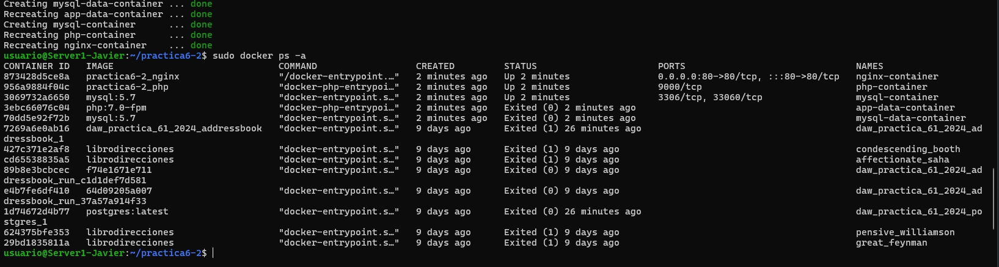

y ahora veremos la pagina de bienvenida de php
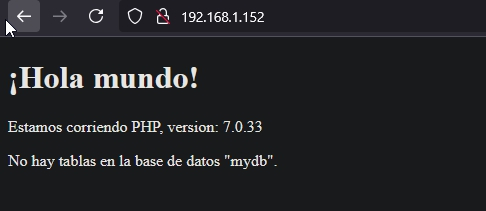


en index.php sustituimos el contenido por este

```php
$user = "root";
$password = "secret";
```


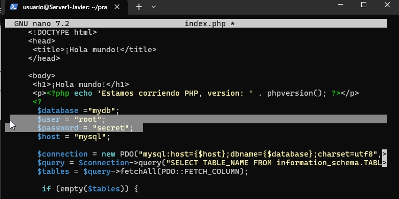

y ahora veremos la pagina de bienvenida de php
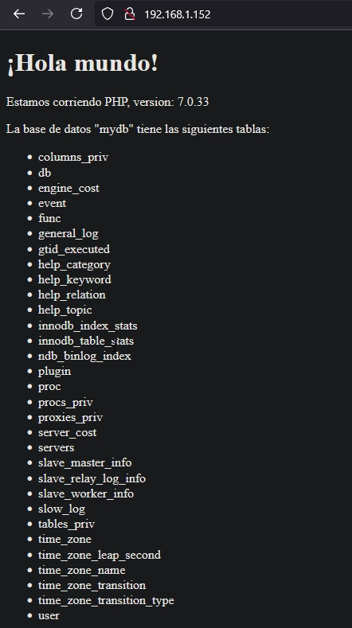

y con esto terminamos la practica 6.2. Tenemos funcionado un servidor web con php y mysql en contenedores docker
