# Práctica 6.2
## Ejercicios de Docker 
#### Javier Rider Jimenez

### **Despliegue de servidores web con usuarios autenticados mediante LDAP usando Docker y docker-compose**

#### 0. Conexión ssh

conexión ssh con la máquina virtual

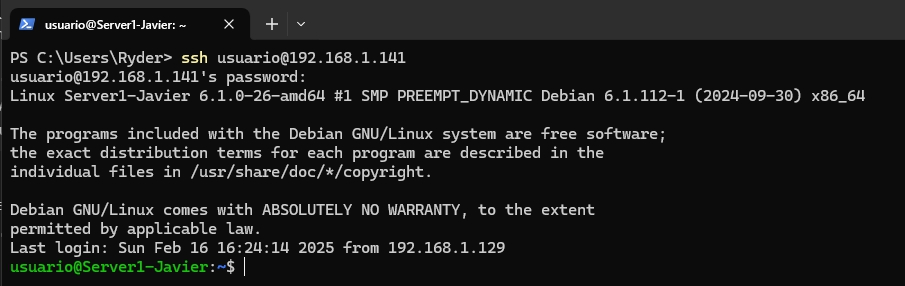

### 1. Despliegue con Docker de NGINX + demonio de autenticación LDAP + OpenLDAP

creamos un directorio par ala aplicacion y con un contenido sencillo

```bash
$ mkdir app

$ cat << EOF > app/index.html
<html>
<body>
<h1>¡Hola Mundo!</h1>
</body>
</html>
EOF
```

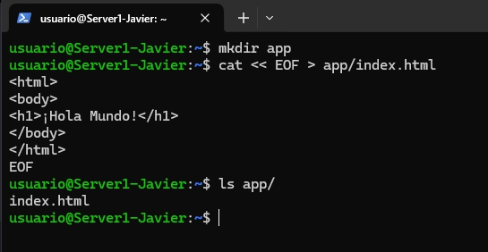

Tambien otor directorio para los archivos de configuracion

```bash
$ mkdir conf

$ cat << EOF > conf/ldap_nginx.conf
    server {
      listen 8080;

      location = / {
         auth_request /auth-proxy;
      }

      location = /auth-proxy {
         internal;

         proxy_pass http://nginx-ldap:8888;

         # URL y puerto para conectarse al servidor LDAP
         proxy_set_header X-Ldap-URL "ldap://openldap:1389";

         # Base DN
         proxy_set_header X-Ldap-BaseDN "dc=example,dc=org";

         # Bind DN
         proxy_set_header X-Ldap-BindDN "cn=admin,dc=example,dc=org";

         # Bind password
         proxy_set_header X-Ldap-BindPass "adminpassword";
      }
   }
EOF
```

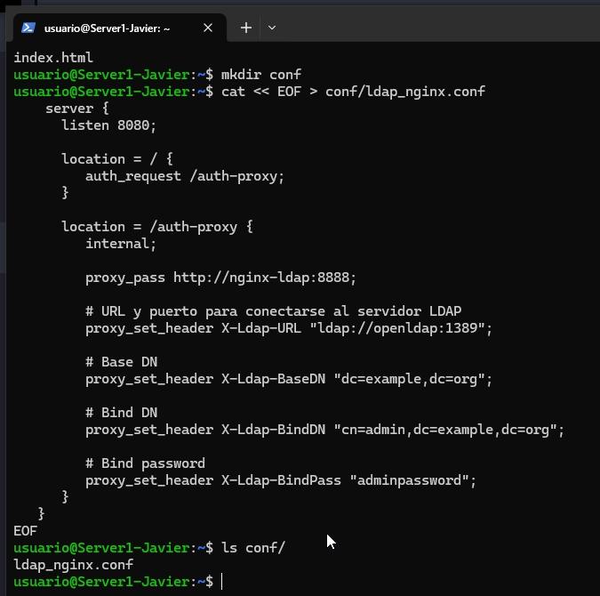

yo lo he movido todo a un directorio para la practica

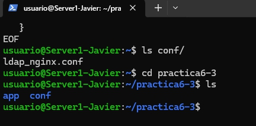

#### 1.2 Creación de un archivo docker-compose.yml


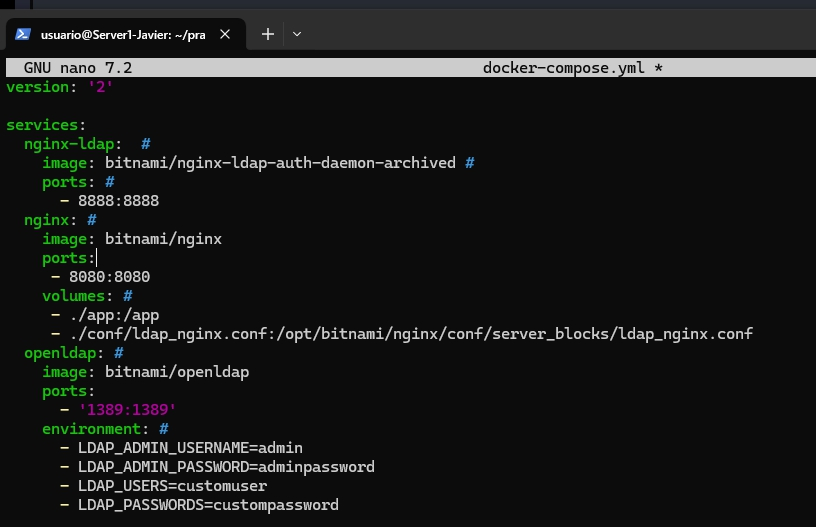

Levantamos el contenedor

```bash
$ docker-compose up -d
```

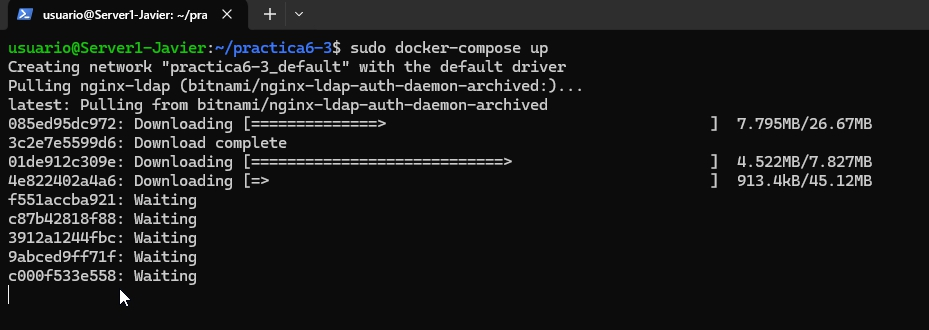


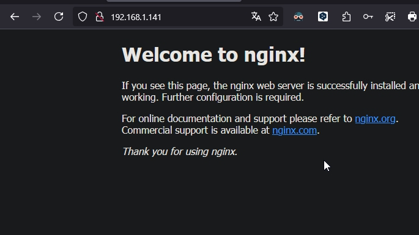


### 2. Despliegue con Docker de PHP + Apache con autenticación LDAP

Esto lo va tambien en el directorio de la practica

Creamos en la raiz index.php

```bash
    <?php
    echo 'Ey, hola usuario autenticado por LDAP!';
    ?>
``` 
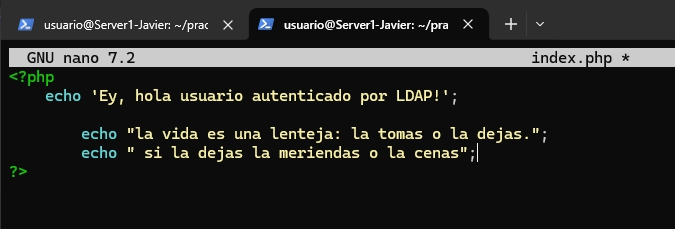

Añadimos tambien el archivo dockerfile en Docker/dockerfile

```bash
# ./Docker/Dockerfile --> directorio donde se encuentra este archivo

# Imagen base sobre la que vamos a trabajar
FROM php:7-apache

# Activamos el módulo LDAP de Apache ejecutando el siguiente comando
RUN a2enmod authnz_ldap

# Añadimos las reglas/configuración de LDAP al directorio conf-enabled de Apache
# (crearemos este archivo en el siguiente paso)
COPY Docker/ldap-demo.conf /etc/apache2/conf-enabled/

# Añadimos ayuda de depuración (debugging) en la configuración de apache
# En caso de necesitarlo, lo descomentamos para ejecutar el siguiente comando
# RUN echo "LogLevel debug" >> /etc/apache2/apache2.conf

# Establecemos el directorio de trabajo adecuado
WORKDIR /var/www/html/demo

# Configuramos Apache para usar la configuración ldap definida arriba, la copiamos de nuestro ordenador al contenedor
COPY Docker/.htaccess ./.htaccess

# Copiamos los archivos del proyecto que necesitamos al contenedor
COPY index.php ./
```

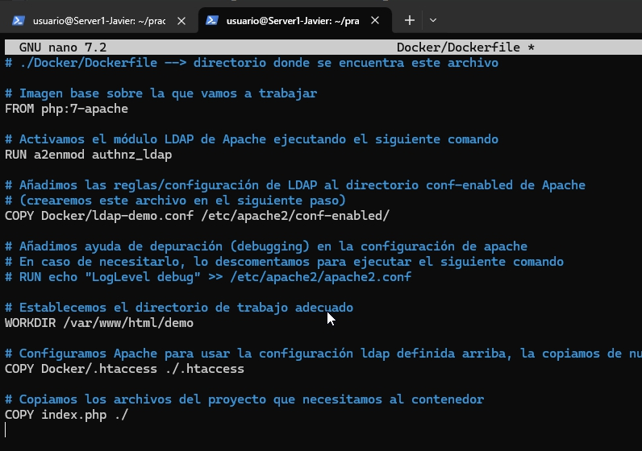

Añadimos el archivo de configuración ldap-demo.conf en Docker/ldap-demo.conf

```bash
# ./Docker/ldap-demo.conf
PassEnv LDAP_BIND_ON
PassEnv LDAP_PASSWORD
PassEnv LDAP_URL
<AuthnProviderAlias ldap demo>
    AuthLDAPBindDN ${LDAP_BIND_ON}
    AuthLDAPBindPassword ${LDAP_PASSWORD}
    AuthLDAPURL ${LDAP_URL}
</AuthnProviderAlias> 
```

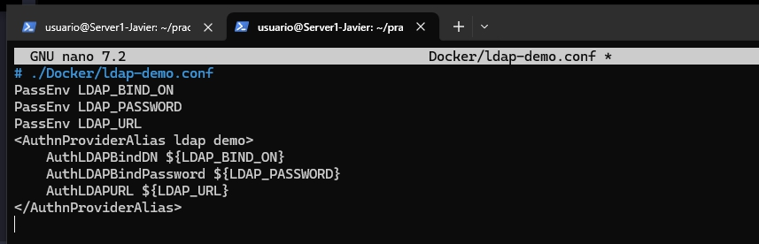

Añadimos el archivo .htaccess en Docker/.htaccess

```bash
# .Docker/.htaccess
AuthBasicProvider demo
AuthType Basic
AuthName "Protected Area"
Require valid-user
```

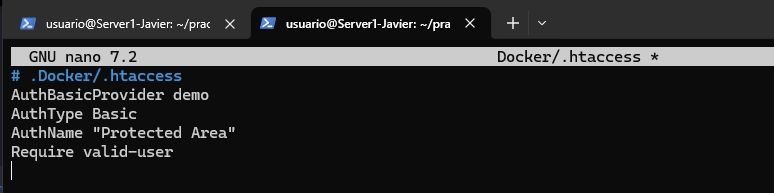

y ahora lanza el contenedor

```bash
docker build . \
    -t docker-ldap \
    -f ./Docker/dockerfile
```	

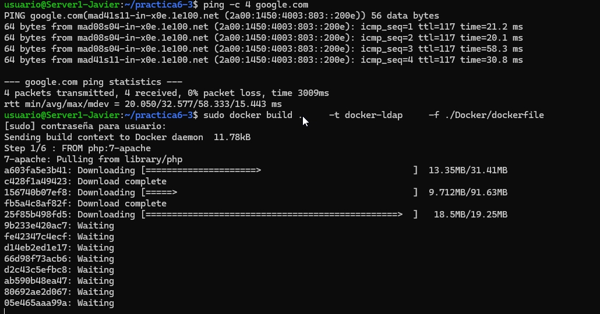


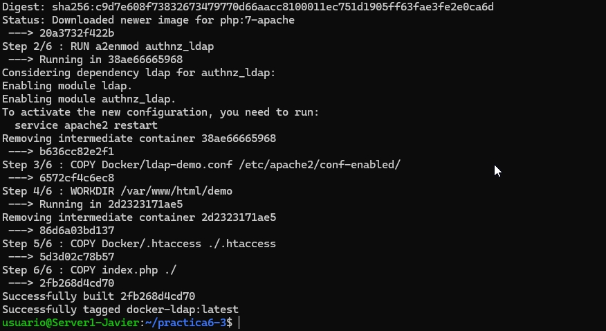

si todo ha ido bien, deberiamos ver algo como esto

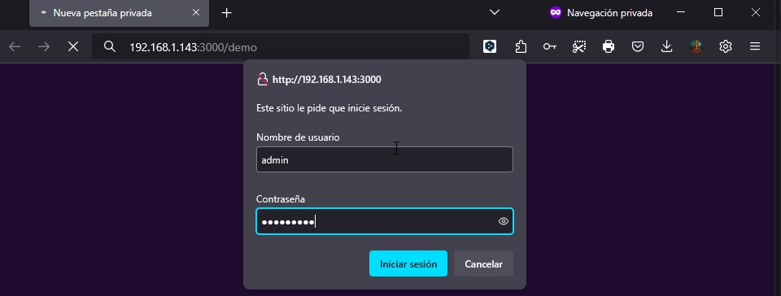

ponemos el usuario y contraseña que hemos creado en el LDAP. admin y Secret123. y con esto vemos nuestra aplicacion de php

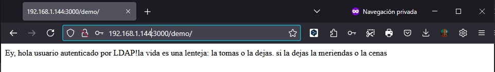

A comentar: En este ultimo paso ha habido varios problemas, dado que no paraba de perder la capacidad de conectarse a internet. he tenido que reiniciar multiples veces la maquina hasta que ha funcionado. 